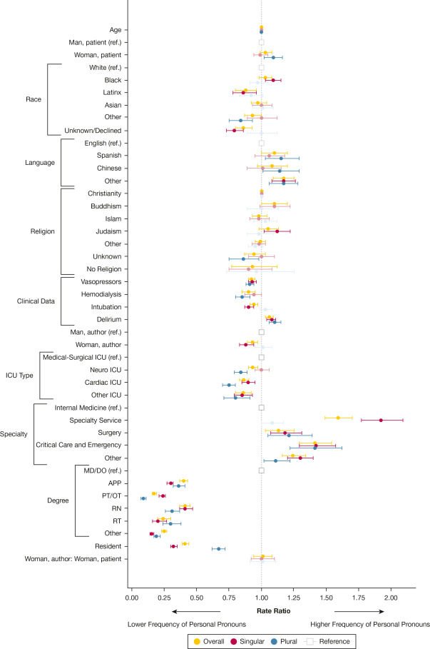

+++ 
draft = false
date = 2026-09-01T14:55:51-07:00
title = "Clinician Self-Referentiality: Factors Associated With Author Pronoun Use in the Notes of Critically Ill Patients"
description = "This post summarizes a CHEST Critical Care publication analyzing personal pronoun use across 842,953 ICU notes from 5,799 patients. Using cluster-robust Poisson regression on pronouns identified via NLP part-of-speech tagging, the study found that pronoun frequency is driven primarily by author characteristics—clinical role, training level, specialty, and gender—rather than patient demographics or illness severity. Residents, nurses, and therapists used far fewer personal pronouns than attending physicians, and singular ('I') and plural ('we') pronouns behaved differently. The findings suggest pronoun use reflects documentation norms and professional role more than clinician agency or patient connection."
slug = ""
authors = ["Hunter Mills"]
tags = []
categories = ["Publication Summary"]
externalLink = ""
series = []
+++
[Publication Link](https://doi.org/10.1016/j.chstcc.2026.100294)

## Why Pronouns?

Clinical notes are more than a record of facts—they externalize how the writer thinks about a patient. We have previously studied uncertainty language, combat metaphors, race mentions, and implicit bias in ICU notes; this paper turns to an even subtler signal: **personal pronouns**. In spoken encounters, "I" can signal individual accountability, while "we" can communicate shared decision-making—or diffuse responsibility. We wanted to know what drives pronoun use in *written* ICU documentation, where agency, ownership, and depersonalization all have real consequences for patient care.

## The Study in a Nutshell

We ran a retrospective cohort study of **842,953 notes** from **5,799 adult patients** admitted to five UCSF ICUs (2012–2022), written by **10,033 unique authors** spanning physicians, residents, advanced practice providers, nurses, respiratory therapists, and physical/occupational therapists.

* **Outcome:** personal pronoun frequency per note, modeled as a rate per sentence (overall, singular, and plural).
* **NLP pipeline:** notes were tokenized with NLTK, and the Average Perceptron Tagger distinguished true pronouns from look-alikes (e.g., "type I diabetes"), validated by manual review of 200 random sentences.
* **Modeling:** cluster-robust Poisson regression with an offset for sentence count, multiple imputation for missing covariates, plus sensitivity and subset analyses to rule out documentation-style artifacts and attending attestation effects.

## The Core Finding in Plain English

Personal pronouns appeared in 53% of notes—but **who wrote the note mattered far more than who the note was about**. Patient-level factors (gender, age, race, language, religion, even clinical severity markers like intubation and vasopressors) had consistently tiny effect sizes (SMDs of 0.01–0.04). Author-level factors told a different story:

| Author Factor | Effect on Pronoun Use (vs. reference) |
|:---|:---|
| PT/OT | **83% fewer** pronouns than MD/DO (RR 0.17) |
| RT | 76% fewer (RR 0.24) |
| RN | 59% fewer (RR 0.41) |
| APP | 60% fewer (RR 0.40) |
| Resident (vs. attending) | 59% fewer (RR 0.41) |
| Woman author (vs. man) | 7% fewer (RR 0.93) |
| Specialty service (vs. internal medicine) | 59% **more** (RR 1.59) |
| Critical care / emergency medicine | 41% more (RR 1.41) |

Gender concordance between author and patient—despite our hypothesis—showed **no significant association** in the primary analysis.

|Figure 1: Rate ratios for personal pronoun use across covariates|
|:---:|
||

## I ≠ We

Singular and plural pronouns behaved differently, which matters because they carry different meanings. Women authors used less "I" but no less "we." Residents leaned on "we" over "I" (RR 0.67 vs. 0.32 compared with attendings)—possibly reflecting the team-based nature of training, reduced ownership, or discomfort with high-acuity decisions. Meanwhile, PTs and OTs avoided "we" even more strongly than "I". Since "we" can simultaneously mean the care team, the institution, or the clinician–patient dyad, interpreting it requires caution.

## What This Means for ML/NLP Practitioners

1. **Pronouns are not a clean proxy for engagement.** RN notes had few pronouns despite nurses often having the *most* patient contact—their notes are shorter and task-oriented. Feature engineering on clinical text must account for role-specific documentation norms.
2. **Author metadata is a confounder.** Any model using linguistic style as a signal (sentiment, bias, agency) should stratify or adjust by author role, training level, and specialty.
3. **Copy-paste and templates muddy the water.** These weren't preserved in the de-identified dataset and may inflate pronoun counts—worth remembering for anyone building on similar corpora.
4. **AI scribes may shift everything.** As computer-assisted documentation spreads, linguistic patterns could drift toward objectivity, decoupling note language from the author's actual reasoning.

## Take-Home Message

Pronoun use in ICU notes says more about the writer—their role, training, specialty, and gender—than about the patient. Rather than reading "I" as ownership and its absence as detachment, we should treat pronoun frequency as a window into **documentation culture**. The next step is qualitative work: asking authors what they meant, and asking patients and families—who increasingly read these notes—what they hear.
