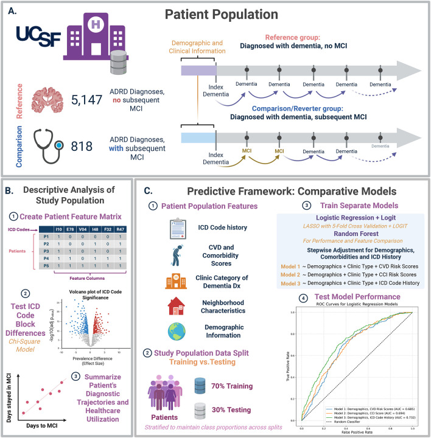
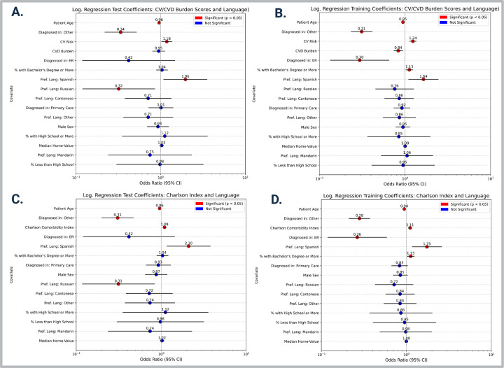

+++ 
draft = false
date = 2025-07-16T12:54:28-08:00
title = "Diagnostic Reversion in Dementia Care: A Real-World Analysis of Mild Cognitive Impairment Diagnoses Following Dementia in a Large Electronic Medical Record System"
description = ""
slug = ""
authors = ["Hunter Mills"]
tags = []
categories = ["Publication Summary"]
externalLink = ""
series = []
+++
[Publication Link](https://www.medrxiv.org/content/10.1101/2025.07.16.25331678v2.full.pdf)

## Why Look at “Diagnostic Reversion”?

Mild cognitive impairment (MCI) is usually framed as a **precursor** to dementia. When an electronic health record (EHR) shows a patient labeled with dementia *first* and later receives an MCI code, something is off. Either the original dementia diagnosis was premature, or the subsequent MCI label is erroneous. Understanding how often this happens—and which patients are most likely to experience it—can expose gaps in clinical decision‑making, highlight health‑equity issues, and point to opportunities for more robust diagnostic pathways.

## Study Overview
* **Cohort:** 5,965 UCSF Health patients, age ≥ 50, with an incident dementia diagnosis between 1988–2024.
* **Groups:**
	* **Reference (86.3%, N=5,147):** Dementia diagnosis without any later MCI code.
	* **Reverters (13.7%, N=818):** Received an MCI diagnosis after the initial dementia code.
* **Data source:** Structured ICD‑9/ICD‑10 codes extracted from the UCSF EHR.
* **Predictors:** Demographics, preferred language, clinic type, cardiovascular‑risk scores, Charlson Comorbidity Index (CCI), and a binary matrix of 101 aggregated ICD‑block codes (derived from >1,900 raw codes).

## Analytical Pipeline

1. **Feature construction:** built a patient‑level matrix of binary ICD‑block presence, plus continuous/compositional covariates.
2. **Descriptive statistics:** chi‑square tests (Benjamini‑Hochberg corrected, p < 0.01) identified 39 ICD blocks differing between groups.
3. **Predictive modeling:**:
	* **Group LASSO‑regularized logistic regression** (5‑fold CV) for feature selection.
	* **Standard logistic regression (LOGIT)** on the selected features for coefficient estimation.
	* **Parallel random‑forest models** for non‑linear comparison.
4. **Evaluation:** stratified 70/30 train‑test split; performance measured with AUROC, AUPRC, and threshold‑optimized F1 scores.

|Overview|
|:---:|
||

## Key Findings

|Variable|Direction of Association (Test Set)|
|:---|:---|
|Younger age|Higher odds of reversion|
|Spanish‑language preference|Lower odds of reversion|
|Higher cardiovascular‑risk score|Lower odds of reversion|
|Higher Charlson Comorbidity Index|Lower odds of reversion|
|Diagnosis in “other specialty” clinics|Higher odds of reversion|
|Russian‑language preference|Higher odds of reversion|

|Results|
|:---:|
||

#### ICD‑Block Signals

* **More common in reverters:** dizziness/giddiness (R42), depressive episodes (F32), osteoarthritis (M19), cataracts (H25/H26), dorsalgia (M54), unspecified injuries (T14), atherosclerosis (I67), immunization encounters, diverticular disease, and various spondylopathies.
* **More common in stable dementia:** chronic kidney disease (N18), atrial fibrillation (I48), fluid/electrolyte disorders (E87), abnormal lung imaging (R91), long‑term drug therapy (Z79), brain disorders (G93), respiratory disorders (J98).

#### Model Performance

* **Logistic regression (best specification):** AUROC ≈ 0.74, AUPRC ≈ 0.32. Threshold tuning (maximizing F1) lifted sensitivity to ≈ 0.75 and F1 to ≈ 0.35.
* **Random forest:** AUROC ≈ 0.73, AUPRC ≈ 0.31; F1 after tuning ≈ 0.38.
* **Interpretability advantage:** Logistic models delivered calibrated odds ratios, making clinical translation straightforward; random forests offered comparable discrimination but less transparent effect sizes.

## What Does This Mean for Practice?

1. **Diagnostic Uncertainty Is Real and Structured:** Roughly one in seven dementia patients later receive an MCI label, suggesting systematic over‑diagnosis or coding inconsistencies.
2. **Language Barriers Matter:** Spanish‑speaking patients are twice as likely to experience reversion, hinting at communication gaps, insufficient interpreter use, or culturally nuanced symptom presentation.
3. **Younger Patients Are Vulnerable:** Younger age correlates with higher reversion, possibly because early‑onset dementia is rarer and clinicians may err on the side of a premature dementia label.
4. **Comorbidity Load Influences Coding:** Higher CCI scores raise reversion odds, perhaps because complex medical histories blur cognitive assessments.
* **Clinic Setting Shapes Certainty:** Diagnoses made in dedicated dementia clinics or primary‑care settings are more prone to reversal than those made in ER or “other specialty” clinics, underscoring the value of specialist input and longitudinal follow‑up.

## Practical Takeaways for Clinicians & Health Systems

* **Implement Structured Follow‑Up Protocols** after a dementia diagnosis, especially for younger and Spanish‑speaking patients, to confirm or refine the label.
* **Standardize Cognitive Assessment Documentation** (e.g., MoCA, MMSE) in the EHR to reduce reliance on billing codes alone.
* **Invest in Language‑Concordant Care:** interpreter services, bilingual clinicians, and culturally adapted screening tools can mitigate misclassification.
* **Leverage Predictive Alerts:** a lightweight logistic‑regression‑based risk score (using age, language, CVD risk, CCI, and a handful of high‑impact ICD blocks) could flag patients at elevated reversion risk for multidisciplinary review.
* **Audit Coding Practices** regularly to ensure that ICD transitions reflect genuine clinical change rather than administrative convenience.

## Limitations Worth Noting

* **Billing‑Code Reliance:** ICD entries may miss nuance, especially for subtle cognitive changes.
* **Single‑Site Cohort:** UCSF’s academic environment limits generalizability to community hospitals or rural systems.
* **Unstructured Data Excluded:** Narrative notes, neuropsychological test scores, and medication records could refine the phenotype but were not incorporated.
* **Class Imbalance:** The 13.7% reversion rate constrained model precision; future work should explore oversampling or synthetic minority techniques.

## Future Directions

* **Multi‑Center Validation:** Apply the same pipeline to other health systems (e.g., Kaiser, VA) to test external robustness.
* **Natural‑Language Processing:** Extract cognitive assessment scores and clinician impressions from progress notes to complement structured codes.
* **Intervention Trials:** Randomize flagged high‑risk patients to intensified diagnostic review versus usual care to measure impact on diagnostic stability and downstream outcomes (e.g., medication appropriateness, care planning).

