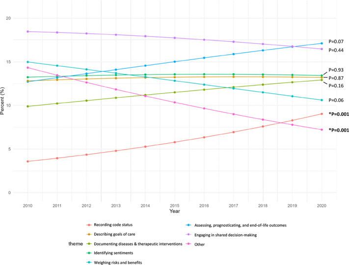

+++ 
draft = false
date = 2026-03-28T09:50:48-07:00
title = "How ICU clinicians document ‘Futility’: A 10-year analysis of critical care notes using natural language processing notes"
description = ""
slug = ""
authors = ["Hunter Mills"]
tags = []
categories = ["Publication Summary"]
externalLink = ""
series = []
+++

[Publication Link](https://www.sciencedirect.com/science/article/pii/S0883944126001048)

In the high-stakes environment of the Intensive Care Unit (ICU), the concept of "medical futility" is a lightning rod for ethical conflict. Clinicians often estimate that 20–40% of patients receive treatments they perceive as non-beneficial. Yet, despite the frequency of these conflicts, the term "futility" itself is rarely used in the medical record.

In our new study, *"How ICU clinicians document 'Futility': A 10-year analysis of critical care notes using natural language processing,"* we moved beyond surveys and manual chart reviews to analyze **2.46 million ICU notes** from nearly 10,000 patients across a decade (2010–2020).

Using unsupervised neural networks and distributional semantic analysis, we uncovered how clinicians actually talk about futility—and how that language is evolving.

## The Paradox of Usage

The most striking finding? **Clinicians almost never use the word.**

Across 2.46 million notes, mentions of "futile" or "futility" appeared in only **137 out of every 100,000 notes**. That is 0.01%. This is starkly lower than the prevalence of "goals of care" discussions (approx. 21.6% in other studies).

Why the discrepancy?
1. **Medicolegal Caution:** The word "futility" carries heavy legal and ethical baggage. Clinicians may be avoiding it to protect themselves and their institutions.
2. **Semantic Shift:** Clinicians aren't ignoring the concept; they are describing it using different vocabulary. They are talking about *prognosis*, *risks*, *code status*, and *sentiments* rather than labeling a treatment "futile."

## Eight Themes of "Futility"

We didn't just count words; we mapped the semantic landscape. Using word2vec models trained annually on the entire ICU corpus, we identified the terms most statistically associated with "futile/futility" and grouped them into **eight distinct themes**:

| Theme | Average Frequency | Key Terms |
|-------|-------------------|-----------|
| Decision Making | 18% | proxy, decided, lean towards |
| Assessing, Prognosticating, and End-of-Life Outcomes | 15% | grave, incurable, maximally tolerated |
| Identifying Sentiments | 13% | betrayal, distrust, partnering, solidarity |
| Weighing Risks and Benefits | 11–15% | beneficial, harmful, prudent, too risky |
| Documenting Diseases and Therapeutic Interventions | 10–13% | antiarrhythmic agent, artificial nutrition |
| Describing Goals of Care | 13% | heroic measures, palliative, conservative |
| Recording Code Status | 4–9% | DNR, CPR, intubation, mechanical ventilation |
| Other | 7–14% | bandwidth, complexity, fact |

|     |
|-----|
||

## The Evolution of Documentation

The data reveals a clear shift in how these concepts are recorded. While the overall frequency of the word "futility" remained flat, the *context* changed.

The significant rise in **Recording Code Status** suggests clinicians are increasingly anchoring their discussions of futility in concrete, actionable orders (DNR/DNI) rather than abstract philosophical debates. This likely reflects a shift toward defensibility and clarity in the face of potential conflict. Conversely, the decline in "Weighing Risks and Benefits" hints that the ethical calculus in documentation is moving away from pure beneficence/non-maleficence toward autonomy and legal clarity.

## Why This Matters for AI and Ethics

As an ML engineer, I see the implications for Large Language Models (LLMs) and clinical decision support systems.

If we train AI on medical notes expecting it to identify "futile care" based on the keyword "futile," we will miss 99.9% of the relevant cases. Our study proves that the semantic context of futility is **heterogeneous and evolving**.

* **Bias Detection:** The framework we built can help identify implicit biases in how different demographics are discussed in the context of "futility."
* **Intervention Design:** EHR alerts for palliative care or ethics consults shouldn't trigger on the word "futile." They should trigger on the *combination* of themes we identified (e.g., high-risk prognosis + code status discussion + sentiment markers).
* **Explainability:** For LLMs to be trusted in critical care, they must understand that "futility" is often a proxy for a complex negotiation of autonomy, prognosis, and family dynamics, not just a binary physiological failure.

## Conclusion

Medical futility is not a static definition; it is a dynamic conversation. By analyzing 10 years of raw clinical text, we've shown that clinicians are navigating this minefield with nuance, often avoiding the loaded term "futility" in favor of documenting the *process* of care and the *status* of the patient.

For the next generation of health AI, the lesson is clear: **Don't look for the word. Look for the pattern.**

