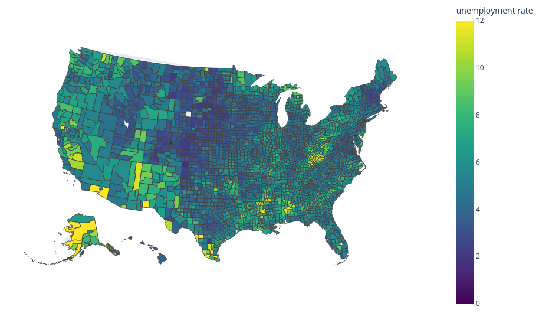

+++ 
draft = false
date = 2026-02-21T19:44:23-08:00
title = "Updating Plotly’s Choropleth Example with Current US Census Data"
description = ""
slug = ""
authors = ["Hunter Mills"]
tags = []
categories = ["Principled Deprivation Index", "Tutorial"]
externalLink = ""
series = []
+++

## Introduction
Plotly/Dash makes it easy to build interactive dashboards, and its choropleth maps are a great way to visualize geographic data. Unfortunately, the [official example](https://plotly.com/python/choropleth-maps/#choropleth-map-using-geojson) uses outdated unemployment data and an old GeoJSON file. Since U.S. county boundaries change over time, those IDs no longer line up with the latest Census data.



In this post I’ll show how to replace the stale assets with fresh data pulled directly from the U.S. Census Bureau.

## What Is GeoJSON?

GeoJSON is a lightweight, text‑based format for encoding geographic data. It supports several geometry types—`Point`, `LineString`, `Polygon`, `MultiPoint`, `MultiLineString`, `MultiPolygon`, and `GeometryCollection`—wrapped in `Feature` objects that can carry additional properties.

A minimal GeoJSON file looks like this:
```json
{
  "type": "FeatureCollection",
  "features": [
    {
      "type": "Feature",
      "geometry": { "type": "Point", "coordinates": [lon, lat] },
      "properties": { "name": "Sample location" }
    }
  ]
}
```

Key points

* **type** – identifies the object (`Feature`, `FeatureCollection`, etc.).
* **coordinates** – ordered as [`longitude`, `latitude`] (altitude optional).
* **properties** – arbitrary attributes attached to each feature.

The Census Bureau doesn’t publish GeoJSON directly; instead it provides shapefiles.

## U.S. Census Shapefiles

The Census Bureau’s primary vector product is the **TIGER/Line Shapefiles**. These files contain boundaries for states, counties, tracts, block groups, blocks, roads, railroads, water features, and more. Each feature includes fields such as `GEOID`, `NAME`, and other census‑specific codes that let you join demographic data from the American Community Survey (ACS) or Decennial Census.

Shapefiles are updated regularly.

**Where to get them**

* **TIGER/Line Shapefiles portal** – [here](https://www.census.gov/geographies/mapping-files/time-series/geo/tiger-line-file.html)
* **Data.gov** – for example, the 2024 county shapefile for congressional district 119: [here](https://catalog.data.gov/dataset/2024-cartographic-boundary-file-shp-119th-congressional-district-within-current-county-and-equi/resource/e5b5cf55-7c9b-4a85-82fd-751da9fce77d). We will be using this file.

After downloading, unzip the archive (`cb_2024_us_county_within_cd119_500k.zip`). The resulting files can be read directly by GIS software (QGIS, ArcGIS) or by Python libraries such as **GeoPandas** and Fiona.

## Converting Shapefiles to GeoJSON with GeoPandas

GeoPandas extends pandas to handle geospatial data, providing GeoSeries and GeoDataFrame objects that store Shapely geometry objects. This lets you manipulate spatial data almost exactly like tabular data.
Below is a concise snippet that loads the county shapefile, merges multipart geometries, simplifies the polygons, and writes out a GeoJSON file.

```python
import geopandas as gpd

# Load US Census shapefile
fpath = "cb_2024_us_county_within_cd119_500k/cb_2024_us_county_within_cd119_500k.shp"
gdf = gpd.read_file(fpath)

# Reproject to WGS84 (lat/lon)
gdf = gdf.to_crs(epsg=4326)

# Merge counties with multiple entries
gb = gdf[['STATEFP', 'COUNTYFP', 'geometry']].groupby(['STATEFP', 'COUNTYFP'])
l = [[s, c, sub['geometry'].union_all()] for (s, c), sub in gb]
geo = gpd.GeoDataFrame(l, columns=['STATEFP', 'COUNTYFP', 'geometry'])

# Simplify polygons -- raise for more detail, lower for less
geo['geometry'] = geo['geometry'].simplify(.005)

# Export to GeoJSON (no 'id' field yet)
geo.to_file("temp.geojson", driver='GeoJSON')
```

#### Adding an id Field

Plotly’s choropleth expects each feature to have an identifier that matches the values supplied in the locations column. We’ll add an id composed of the state and county FIPS codes. This is the default behavior. To change consult the (Plotly Choropleth Docs)[https://plotly.github.io/plotly.py-docs/generated/plotly.express.choropleth.html]

```python
import json

with open("temp.geojson") as fp:
    d = json.load(fp)

# Add 'id' = STATE + COUNTY (both strings)
for e in d['features']:
    e['id'] = e['properties']['STATE'] + e['properties']['COUNTY']

# Write the final GeoJSON
with open('geojson-counties-fips-post-2024.json', 'w') as fp:
    json.dump(d, fp)
```

## Getting Updated Unemployment Data

The ACS provides county‑level unemployment rates. Below is a sample API call for 2023 data (append with `&key=<YOUR KEY>`  if you have a US Census API Key):

```http
https://api.census.gov/data/2023/acs/acs5/subject?get=NAME,S2301_C04_001E&ucgid=pseudo(0100000US%240500000)
```

Save the JSON response as unemp.csv and run the following to reshape it for Plotly:

```python
import pandas as pd

# Census Unemployment 
# * Data: 2023/acs/acs5"
# * Unemployment Rate: "S2301_C04_001E"
# * County Aggregator: "pseudo(0100000US\$0500000)"

# Load the CSV produced from the API response
df = pd.read_csv('unemp.csv')

# Extract the FIPS code from the ucgid field
df['fips'] = [e.split('US')[1] for e in df['ucgid']]

# Rename the unemployment column for clarity
df = df.rename(columns={'S2301_C04_001E': 'unemp'})

# Keep only the columns needed for the map
df[['fips', 'unemp']].to_csv('fips-unemp-23.csv', index=False)
```

## Final Thoughts

Maintaining up‑to‑date examples for a fast‑moving ecosystem like Plotly is challenging. By pulling the latest shapefiles from the Census and pairing them with current ACS data, you ensure that your visualizations stay accurate as county boundaries evolve.

Feel free to adapt this workflow for other geographic levels (states, tracts, block groups) or different socioeconomic indicators. Happy mapping!

## Putting It All Together: The Updated Plotly Example

Now we have a fresh GeoJSON file (`geojson-counties-fips-post-2024.json`) and a CSV of unemployment rates (`fips-unemp-23.csv`). The following script creates an interactive choropleth map. 

```python
import json

import geopandas as gpd
import pandas as pd

# Census Unemployment 
# * Data: 2023/acs/acs5"
# * Unemployment Rate: "S2301_C04_001E"
# * County Aggregator: "pseudo(0100000US\$0500000)"
df = pd.read_csv('unemp.csv')
df = df.rename(columns={'ucgid': 'GEO_ID'})

# US Census Shape file
fpath = "cb_2024_us_county_within_cd119_500k/cb_2024_us_county_within_cd119_500k.shp"
gdf = gpd.read_file(fpath)

# *** Get County Polygons ***
gdf = gdf.to_crs(epsg=4326)

# merge counties with multiple polygons
gb = gdf[['STATEFP', 'COUNTYFP', 'geometry']].groupby(['STATEFP', 'COUNTYFP'])
l = [[s, c, sub['geometry'].union_all()] for (s, c), sub in gb]
geo = gpd.GeoDataFrame(l, columns=['STATEFP', 'COUNTYFP', 'geometry'])

# simplify polygons
geo['geometry'] = geo['geometry'].simplify(.005)

# *** Get Census Area ***

# convert to sq mile
gdf['CENSUSAREA'] =  gdf['ALAND'] * 3.86102e-7

# sum areas for counties with multiple entries
area = gdf[['STATEFP', 'COUNTYFP', 'CENSUSAREA']] \
          .groupby(['STATEFP', 'COUNTYFP']).sum()

# *** Merge Calculated Results ***
out = geo.merge(area, on=['STATEFP', 'COUNTYFP'])

# *** Make GEO_ID, LSAD, NAME ***
# Make GEO_ID
out['GEO_ID'] ='0500000US' + out['STATEFP'] + out['COUNTYFP']

# US Census formats County Name as f'{county_name} {lsad}, {state_name}'

# Deal with multi word LSAD
# City and Borough, Census Area, Planning Region
def split_name(s):
    name, state = s.split(',')
    if s[-16:] == 'City and Borough':
        name = name[:-16]
        lsad = 'City and Borough'
    elif s[-11:] == 'Census Area':
        name = name[:-11]
        lsad = 'City and Borough'
    elif s[-15:] == 'City and Borough':
        name = name[:-15]
        lsad = 'Planning Region'
    else:
        parts = name.split(' ')
        name = ' '.join(parts[:-1])
        lsad = parts[-1]
    return name, lsad

pairs = [split_name(s) for s in df['NAME']]

# get LSAD -- remove state and county
df['LSAD'] = [lsad for _, lsad in pairs]
# get county name -- remove state and LSAD
df['NAME'] = [name for name, _ in pairs]

# *** Finalize GeoJSON ***
# Merge, harmonize names, and match order from original
out = out.merge(df[['GEO_ID', 'NAME', 'LSAD']], on='GEO_ID')
out = out.rename(columns={'STATEFP': 'STATE', 'COUNTYFP': 'COUNTY'})
out = out[[
    'GEO_ID',
    'STATE',
    'COUNTY',
    'NAME',
    'LSAD',
    'CENSUSAREA',
    'geometry',
]]

# to file will not add 'id' as in original 
out.to_file("temp.geojson", driver='GeoJSON')
with open("temp.geojson") as fp:
    d = json.load(fp)

# add id
for e in d['features']:
    e['id'] = e['properties']['STATE'] + e['properties']['COUNTY']

# dump geojson
with open('geojson-counties-fips-post-2024.json', 'w') as fp:
    json.dump(d, fp)

# *** Unemployment CSV ***
df['fips'] = [e.split('US')[1] for e in df['GEO_ID']]
df = df.rename(columns={'S2301_C04_001E': 'unemp'})
df[['fips', 'unemp']].to_csv('fips-unemp-23.csv', index=False)

### Plotly Example

import json

import pandas as pd
import plotly.express as px

with open('geojson-counties-fips-post-2024.json') as fp:
    counties = json.load(fp)

df = pd.read_csv("fips-unemp-23.csv", dtype={"fips": str})

fig = px.choropleth(df, 
                    geojson=counties, 
                    locations='fips', 
                    color='unemp',
                    color_continuous_scale="Viridis",
                    range_color=(0, 12),
                    scope="usa",
                    labels={'unemp':'unemployment rate'})
fig.update_layout(margin={"r":0,"t":0,"l":0,"b":0})
fig.show()
```