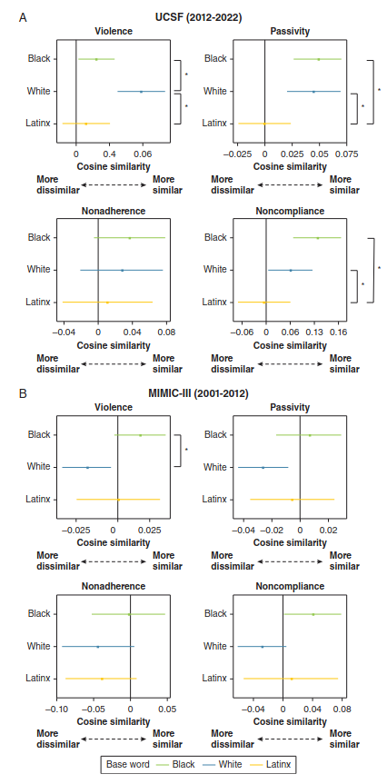

+++ 
draft = false
date = 2024-06-01T20:19:22-08:00
title = "Measuring Implicit Bias in ICU Notes Using Word-Embedding Neural Network Models"
description = ""
slug = ""
authors = ["Hunter Mills"]
tags = []
categories = ["Publication Summary"]
externalLink = ""
series = []
+++
[Publication Link](https://journal.chestnet.org/article/S0012-3692(24)00007-2/abstract)

## Why This Study Matters
Clinical documentation is the backbone of modern intensive‑care practice, yet the language clinicians use can subtly reflect—and reinforce—societal biases. While overtly hateful phrasing is rare, **implicit bias**—the unconscious association of certain racial or ethnic descriptors with stigmatizing terms—can shape how patients are perceived and treated. As machine‑learning (ML) models increasingly ingest electronic health‑record (EHR) notes for predictive analytics, any hidden bias in those notes may be amplified, jeopardizing algorithmic fairness and patient equity.

## What We Did
We leveraged **unsupervised word‑embedding models (word2vec)** to quantify the contextual similarity between race/ethnicity descriptors (Black, White, Latinx) and four thematic groups of potentially stigmatizing language:

|Theme|Example Words|
|:---|:---|
|Violence|combative, aggressive, angry
|Passivity|non‑cooperative, resistant, challenging|
|Nonadherence|non‑adherent, non‑compliant|
|Noncompliance|non‑compliant, non‑adherence|

Two large ICU note corpora were analyzed:

|Dataset|Institution|Years Covered|Notes|Patients
|:---|:---|:---|:---|:---|
UCSF|University of California, San Francisco|2012‑2022|392,982|8,214|
|MIMIC‑III (BIDMC)|Beth Israel Deaconess Medical Center (Boston)|2001‑2012|887,697|38,512|

For each descriptor‑theme pair we computed *cosine similarity* across 20 stochastic runs, reporting both simple means and *precision‑weighted means*. Bootstrap resampling supplied 95% confidence intervals (CIs).

## Key Findings
|Descriptor Pair|UCSF|BIDMC / MIMIC‑III|
|:---|:---|:---|
|Black vs White – Violence| -0.055 [-0.084 - -0.025]; P < .05|0.042 [0.016 - 0.068]; P < .05|
|Black vs White – Passivity|—| 0.033 [0.002 - 0.063]; P < .05|
|Black vs White – Noncompliance|—|0.068 [0.024 - 0.113]; P < .05|
|Black vs Latinx – Passivity|0.051 [0.017 - 0.085]; P < .05|—|
|Black vs Latinx – Noncompliance| 0.110 [0.046 - 0.175]; P < .05|—|

*Take‑home:* Implicit bias is **detectable** in ICU notes, but its direction and magnitude **vary by institution, geography, and era**. In the older Boston dataset, Black descriptors aligned more closely with violent language, whereas in the newer UCSF data they aligned less.

## Interpretation

1. **Bias Is Context‑Dependent:** The same racial descriptor can be linked to very different semantic neighborhoods depending on local documentation culture and temporal trends.
2. **Algorithmic Fairness Risks:** Unsupervised NLP pipelines trained on such notes will inherit these biases, potentially skewing downstream predictions (e.g., risk scores, triage alerts).
3. **Need for Debiasing Strategies:** Simple word‑frequency counts miss these subtleties; embedding‑based metrics give a richer picture and can serve as benchmarks for mitigation (e.g., counter‑factual augmentation, adversarial training).

## Limitations

* **Model Transparency:** Word2vec's embeddings are hard to interpret beyond similarity scores.
* **Descriptor Aggregation:** Collapsing diverse racial/ethnic identifiers into three broad groups loses nuance.
* **Author Metadata Missing:** We could not adjust for clinician specialty, experience, or implicit attitudes.
* **Temporal Granularity:** We treated each dataset as a block; finer‑grained time‑series analysis could reveal evolving bias trajectories.

## Future Directions

* **Fine‑Grained Temporal Modeling:** Sliding windows to track bias drift.
* **Incorporate Author Features:** Linking note‑writer demographics to bias patterns.
* **Test Debiasing Interventions:** Evaluate how counter‑bias training data affect downstream clinical models.
* **Expand to Other Institutions:** Validate whether observed patterns hold nationally and internationally.

## Bottom Line for Practitioners
Even in high‑stakes environments like the ICU, language carries hidden stereotypes. By quantifying these with word‑embedding similarity, we expose a silent driver of inequity that can be addressed before it propagates into AI‑enabled decision support.
