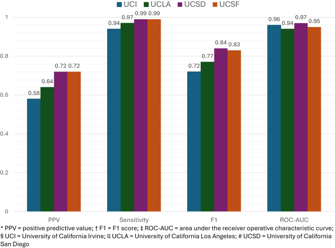

+++ 
draft = false
date = 2026-03-01T14:32:47-08:00
title = "Development and validation of a generalisable machine learning algorithm for identifying interstitial lung disease cohorts: a retrospective cohort study"
description = "A summary of a Lancet-affiliated study developing a generalizable ILD classifier across four UC health systems. Mapped to the OMOP common data model, the gradient-boosting model achieved 0.96 ROC-AUC and 0.97 sensitivity, dramatically outperforming rule-based approaches. External validation at UCI, UCLA, and UCSD confirmed transportability without site-specific tweaks. The authors outline how OMOP-compatible phenotyping pipelines can accelerate multi-center research and improve clinical trial recruitment."
slug = ""
authors = ["Hunter Mills"]
tags = []
categories = ["Publication Summary"]
externalLink = ""
series = []
+++

[Publication Link](https://www.thelancet.com/journals/eclinm/article/PIIS2589-5370(26)00037-4/fulltext)

## Why This Matters

Identifying patients with interstitial lung disease (ILD) in large electronic health record (EHR) repositories has always been a nightmare. Diagnostic codes are noisy, rule‑based filters either miss too many true cases (low sensitivity) or pull in a lot of false positives (low PPV). It is common to build a "Gold Standard" data set using these rules in rare disease prediction--even though the label quality is low. Some researchers are able to achieve high metrics with these poor labels, but it begs the question of the utility of a model that can match substandard labels with high accuracy.

Our team set out to replace that brittle logic with a machine‑learning model that can actually learn the nuanced patterns hidden in routine clinical data on high quality labels—and, crucially, work across health systems without custom rewrites.

## What We Did

|Step|What We Did|Why It Counts|
|:---|:---|:---|
|Data Assembly|Harvested de‑identified EHR data from the UC Health Data Warehouse (six academic centers, 2012‑2024). Included adults ≥18y with ≥5 encounters.|Guarantees enough longitudinal information per patient for robust feature engineering.|
|Gold‑Standard Labels|Used the UCSF ILD Clinic cohort (multidisciplinary diagnosis) as the truth set. Enriched with 10k random non‑ILD controls.|Provides high‑quality labels while keeping class balance realistic for a rare disease.|
|Feature Engineering|Started with 3229 raw variables (diagnoses, procedures, labs, medications, demographics). Clinical experts trimmed to 334 plausible features; ANOVA reduced to the most discriminative subset.|Balances clinical relevance with statistical power and prevents over‑fitting.|
|Model Choice|Gradient Boosting Trees (GBT) with hyper‑parameter tuning via cross‑validation.|GBT handles missing data gracefully, offers decent interpretability (feature importance), and scales well.|
|Common Data Model|Mapped everything to the OMOP CDM, making the pipeline EHR‑agnostic.|Enables deployment at any institution that already uses OMOP (or can convert to it).|
|Internal Evaluation|80/20 train‑test split on UCSF data.|Baseline performance before external testing.|
|External Validation|Applied the trained model unchanged to three independent sites (UCI, UCLA, UCSD) – each contributing ~250 manually reviewed patients.|Tests true generalisability across institutions, EHR implementations, and patient populations.|

## Bottom‑Line Results

|Metric (average across sites)|Universal ILD Classifier|Rule‑Based Approach 1 (≥ 1 ICD code)|Rule‑Based Approach 2 (≥ 2 codes + CT)|
|:---|:---|:---|:---|
|Positive Predictive Value (PPV)|0.67 (0.58‑0.72)|0.55 (0.50‑0.59)|0.67 (0.61‑0.73)|
|Sensitivity|0.97 (0.94‑0.99)|0.98 (0.96‑0.99)|0.59 (0.53‑0.64)|
|F1‑Score|0.79 (0.72‑0.84)|0.71 (0.66‑0.74)|0.63 (0.57‑0.68)|
|ROC‑AUC|0.96 (0.94‑0.97)|0.80 (0.78‑0.82)|0.73 (0.70‑0.76)|

||
|:---:|

#### Key take‑aways:

* **Sensitivity skyrockets** while keeping PPV competitive.
* **Misclassification rates drop dramatically** (McNemar’s test p<10e-13 vs. Approach 1, p = 0.004 vs. Approach 2).
* **Error patterns differ** (Kolmogorov–Smirnov test p<2.2e‑16), indicating the ML model isn’t just shifting mistakes around—it’s fundamentally better at separating signal from noise.

## What This Means for Researchers & Clinicians

1. **Cohort Construction Becomes Scalable:** No more labor‑intensive chart reviews for every new study.
2. **Cross‑Institution Studies Are Feasible:** Because the model runs on OMOP, you can ship the same pipeline to any partner site.
3. **Better Trial Recruitment:** Higher sensitivity means fewer missed eligible patients, respectable PPV keeps screening costs manageable.

## Caveats & Limitations

* **Structured‑Only Data:** We deliberately left out free‑text notes because most sites lack reliable NLP pipelines. That omission caps performance; adding unstructured data could push metrics higher.
* **Academic Center Bias:** All validation sites are large university hospitals. Real‑world performance in community hospitals or health systems with different coding cultures remains unknown.
* **Missingness Patterns:** GBT can absorb missing values, but systematic gaps (e.g., labs not ordered for certain subpopulations) could introduce subtle bias.

## Looking Ahead

* **Integrate NLP:** Extracting phenotype cues from radiology reports and clinic notes is the next logical upgrade.
* **Broaden Disease Scope:** The same OMOP‑centric pipeline can be repurposed for other rare, hard‑to‑code conditions (e.g., systemic sclerosis, sarcoidosis).
* **Open‑Source the Pipeline:** We plan to release the model weights and preprocessing scripts under a permissive license, pending data‑use agreements.

## TLDR

Our Universal ILD Classifier beats the existing rule‑based hacks on every important metric, works across three separate health systems without any site‑specific tweaking, and opens the door to truly large‑scale, reproducible ILD research. The model isn’t perfect—structured data alone limits its ceiling—but it’s a massive step forward from “one code equals disease.”

If you’re building phenotyping pipelines, stop polishing ICD‑code trees and start feeding your data into a gradient‑boosted, OMOP‑compatible model. The gains are real,  and the impact on rare‑disease research could be transformative.
