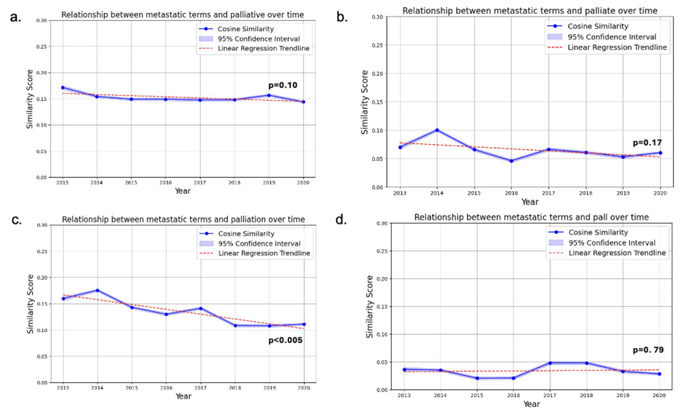

+++ 
draft = false
date = 2025-05-18T12:29:56-08:00
title = "Lexical associations can characterize clinical documentation trends related to palliative care and metastatic cancer"
description = "This post describes a study tracking the semantic relationship between metastatic cancer and palliative-care language across 28 million inpatient notes. Annual Word2Vec models revealed a slow but significant decline in cosine similarity over 2013-2020, suggesting evolving documentation practices. Possible explanations include documentation fatigue, shift toward primary palliative care, and new oncology therapies. The authors argue that embedding-based audits can surface temporal linguistic drift without labeled data, enriching downstream predictive models."
slug = ""
authors = ["Hunter Mills"]
tags = []
categories = ["Publication Summary"]
externalLink = ""
series = []
+++
[Publication Link](https://www.nature.com/articles/s41598-025-01828-z)

## Why Look at Words, Not Just Numbers?

When you sift through millions of electronic health‑record notes, the obvious data points—diagnosis codes, lab values, medication lists—are easy to count. What’s harder to capture is how clinicians talk about a patient’s condition. That language can betray shifting attitudes, workflow pressures, or emerging standards of care. In a new Scientific Reports article, we show exactly how a simple word‑embedding model can surface those hidden trends.

## The Core Idea: Word2Vec Meets the Ward

We fed every inpatient note from 2013‑2020 (over 28 million entries) into a series of Word2Vec models—one per year. Word2Vec turns each token into a high‑dimensional vector, preserving its contextual relationships. By computing cosine similarity between vectors for “metastatic” terms and “palliative‑care” terms, they quantified how tightly the two vocabularies were bound together in everyday documentation.

## What Did We Find?

* **Positive baseline similarity:** Across all years, metastatic and palliative terms co‑occurred more often than random chance, confirming that clinicians routinely discuss both in the same chart.
* **A slow drift apart:** Linear regression revealed a modest decline in similarity, most pronounced for the noun “palliation.” The drop was statistically significant, suggesting a real change in phrasing rather than noise.
* **Robustness checks:** When the analysis was limited to patients with a confirmed metastatic‑cancer ICD code, the same downward trend persisted, albeit with larger confidence intervals (fewer notes, more variability).

|Terms over Time|
|:---:|
||

## Interpreting the Drift
We need to be careful not to equate lexical change with clinical practice change. A weaker lexical bond could mean:

1. **Documentation fatigue:** Clinicians may be using shorthand or omitting palliative‑care language as they become accustomed to standard pathways.
2. **Shift to “primary” palliative care:** More of the palliative work may be happening within primary services, where the term “palliative” is used less explicitly.
3. **Evolving terminology:** New therapies and care models (e.g., immunotherapy) might push the conversation toward disease‑specific language rather than generic “palliative” descriptors.

## Why This Matters for ML Engineers

* **Proof of concept for unsupervised NLP:** Even a classic static embedding model can surface temporal semantic drift without any labeled data.
* **Feature engineering insight:** When building predictive models from clinical text, relying solely on keyword presence may miss nuanced shifts; embedding‑based similarity can be a richer feature.
* **Future directions:** Transformer‑based models (e.g., BERT) could capture context‑dependent meanings and perhaps detect more subtle drifts, especially in the era of “semantic shift” research.

## Takeaways for the Healthcare Community

* **Audit your documentation:** Regular NLP audits can flag unintended changes in language that might affect downstream analytics or quality metrics.
* **Combine quantitative and qualitative:** Pairing embedding trends with clinician interviews would validate whether the observed lexical drift reflects genuine practice evolution.
* **Expand beyond the inpatient setting:** Outpatient and telehealth notes could reveal whether the trend is universal or confined to acute care environments.

## Bottom Line
The study demonstrates that the *how* of note‑taking is as informative as the *what.* By tracking the ebb and flow of key terms, we gain a window into the evolving landscape of palliative‑care delivery for patients with metastatic cancer—without ever needing a single extra data field. For anyone building ML pipelines on EHR text, it’s a reminder: sometimes the most valuable signal lives in the spaces between the words.