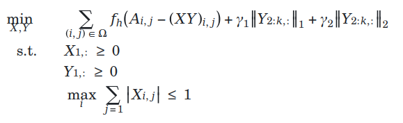
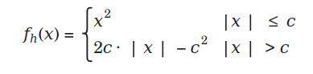

+++ 
draft = false
date = 2026-02-16T18:16:38-08:00
title = "Principled Deprivation Index – A Julia‑Powered, GLRM‑Based Social Metric"
description = ""
slug = ""
authors = ["Hunter Mills"]
tags = []
categories = ["Principled Deprivation Index", "Personal Projects"]
externalLink = ""
series = []
math = true
+++

## Why Build a New Deprivation Index?
Most existing socioeconomic measures (ADI, NDI, SVI) rely on PCA‑style factor analysis. That approach forces you to fill every missing cell with a crude average and produces “centered” scores that hide the real magnitude of deprivation. The consequences are obvious:

* **Missing data gets filled with crude averages**, which can distort local realities. This also assumes that data is missing at random, which is often false. Rural areas have greater missingness.
* **Outliers dominate the factor space**, pulling the whole index in the wrong direction.
* **Interpretability is a nightmare**. The leading component mixes positive and negative loadings, making it impossible to explain to policymakers.

I needed a metric that actually reflects deprivation, tolerates gaps, and stays robust when a few extreme observations appear. The answer is a Generalized Low Rank Model (GLRM) with carefully chosen constraints.

## The Core Idea: Constrained GLRM
A GLRM factorizes an incomplete data matrix A into two low‑rank matrices $X$ and $Y$:
$$A \approx XY$$
What makes this useful for a deprivation index is the ability to **impose constraints directly on the factors**:

|Constraint|Effect|
|---|---|
|Non‑negativity on the first latent dimension ($X_1 \ge 0$, $Y_1 \ge 0$)|Guarantees the primary component is a pure accumulation of deprivation signals—no “negative poverty”.|
|$L_1$ / $L_2$ regularization on later dimensions|Forces explanatory power into the first component, leaving the rest as fine‑tuning knobs.|
|Row‑norm bound|Cap the representations|
|Huber loss|Treats small residuals quadratically but switches to linear for large deviations, reducing outlier influence.|

The optimization problem looks like this:

||
|---|

where $f_h$ is the Huber loss. 

||
|---|

The first column of $XY$ becomes the **Principled Deprivation Index (PDI)** score.

## Data Pipeline – From Raw Sources to a Unified Matrix

The project is split into five sequential stages (scripts 01a–05c). Here’s the high‑level flow:

1. Geography & Census Integration – Stitch HUD, Census, and ZIP‑code crosswalks into a single geographic key for Tract, ZCTA, and County levels; pull the latest ACS variables via the Census API.
2. Feature Engineering – Pull and clean open‑source data: FBI Crime Data Explorer, FEMA Expected Annual Loss, USDA Food Access Atlas, plus a host of Census demographics. All variables are flipped so that higher values always mean greater deprivation, then converted to percentile ranks.
3. Merging & Standardization – Merge everything into a single DataFrame per geography, ensuring a consistent “higher = worse” orientation.
4. Modeling with GLRM – Train a county‑level model to learn the base weight matrix Y. Then lock that Y and learn locality‑specific X matrices for ZCTA and Tract, guaranteeing cross‑scale consistency while allowing local nuance.
5. Validation – Compute Pearson correlations between the PDI and CDC PLACES health outcomes (mental health, diabetes, obesity, etc.) and compare them to NDI, SVI, NRI, and nSES.

## Future Directions
1. Interactive Data Exploration Dashboard
A Shiny‑style (or Plotly Dash) web app that lets analysts:
	* Slice the index by geography, year, or demographic subgroup.
	* Overlay health outcomes, crime rates, or environmental hazards on a map.
	* Drill down from county to tract with instant recalculation of the GLRM factors for a selected subset.
2. Faster Solvers & Distributed Computing
The SCS solver works but slows dramatically on national‑scale tract data. Switching to a GPU‑accelerated conic solver or distributing the X updates across a Spark cluster would bring runtimes down from hours to minutes.
3. Expanded Outcome Set
Beyond CDC PLACES, incorporate education attainment, housing stability, and transportation access metrics. This would let the PDI serve as a more holistic “well‑being” indicator.
4. Open‑Source Community Packaged Release
Package the entire workflow as a Julia Artifact with Docker support, making it trivial for other researchers or municipal analysts to spin up a reproducible environment.

## Get the Code

All scripts, environment files, and example notebooks are hosted on GitHub. Clone the repository and follow the README for a quick start:
https://github.com/huntermills707/principled_deprivation_index

Feel free to open issues, submit pull requests, or just fork the repo and adapt it to your own data. The core idea—using a constrained GLRM to build a transparent, robust deprivation index—is ready for you to take forward.
