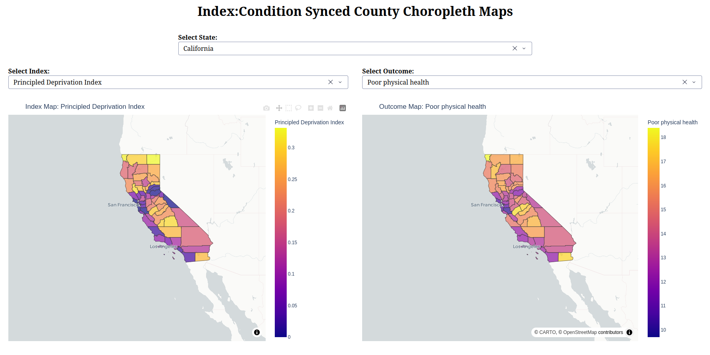

+++ 
draft = false
date = 2026-02-23T17:34:46-08:00
title = "Visualizing Social Determinants of Health at the County Level"
description = ""
slug = ""
authors = ["Hunter Mills"]
tags = []
categories = ["Principled Deprivation Index", "Personal Projects"]
externalLink = ""
series = []
+++

Social determinants of health (SDoH) shape outcomes just as much as clinical care. Yet most public‑health data can be hard to grok in tabular or with static visual, obscuring the granular patterns that drive disparities. I recently built a Plotly/Dash visualizer for the Pricipled Deprivation Index—hosted at [pdi‑visualizer.onrender.com](pdi‑visualizer.onrender.com)—letting anyone explore a suite of deprivation indexes alongside CDC‑reported condition rates, all mapped to U.S. counties.

## Features
* **Two synchronized choropleth maps**: Allows easier exploration
* **State Selector**: Centers viewport and normalizes colormap for greater visual varience
* **Index and Outcome Selectors**: Select different combinations to compare and contrast.
* **Hover‑over details**: Yields exact values for easier reading.
* **Responsive layout**

## What Makes the “Principled Deprivation Index” Worth Mentioning?

The PDI is a composite metric that blends income, education, housing stability, adverse weather, public safety, and food access into a single score. While the code doesn’t compute it (the CSV already contains the values), the visualizer treats it exactly like any other index:

* Higher PDI → Higher deprivation (the scale is inverted compared to typical wealth indices).
* Because it’s normalized across all counties, you can spot outliers instantly: a county with a PDI of 0.85 versus the national mean of ~0.45 signals severe deprivation.

Seeing PDI side‑by‑side with, say, stroke_crudeprev lets you ask the right questions: “Is stroke prevalence driven by deprivation, or are there other factors at play?”

## Bottom Line

The visualizer is a bare‑bones, data‑driven dashboard that does one thing well: juxtapose county‑level deprivation indexes with CDC health outcomes, with instant viewport syncing. It’s not a polished commercial product, but it’s a solid foundation for anyone who wants to explore SDoH patterns without wading through spreadsheets.

If you’re a public‑health analyst, policy maker, or just a data nerd, fire it up, pick a state, and let the maps tell you where the biggest gaps lie. Then decide whether you need to dig deeper—maybe with a predictive model, maybe with community outreach. Either way, you now have a clear visual starting point.

Happy mapping!