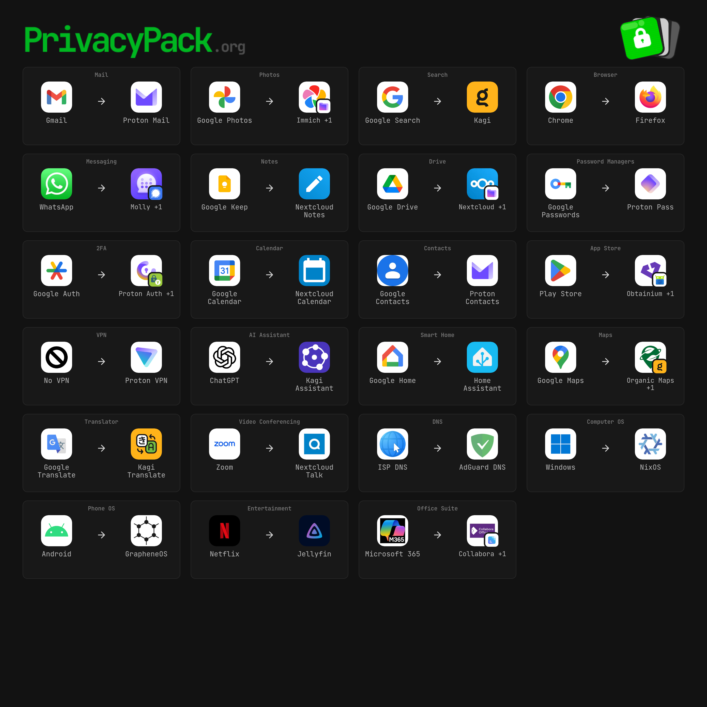

This one is a departure from the usual regression models and homelab write-ups. It's more personal, and it's been sitting in my drafts for a while.

My mother is terminally ill with cancer. I'm not going to write much about that here, because it's hers and ours. But a few weeks ago I opened a page on my phone and was shown an ad for cremation services. Then another. Then they followed me around the web for days.

I work with clinical data for a living. I've spent years building models on EHR notes from critically ill patients, so I know how much care, oversight, and paperwork go into protecting that kind of information inside a hospital. Rationally, I understand roughly how this happens. It still felt like someone had walked into the waiting room, read over my shoulder, and slid a brochure onto my lap.

Nobody told an ad network that my mother is dying. They didn't need to. They inferred it.

## How an algorithm learns your mother is dying

I don't know the exact path in my case, and that's part of the problem: you never do. But the plausible routes aren't mysterious.

- **Searches.** Hospice, palliative care, prognosis for a specific cancer, "what to expect in the last weeks." Each of those is a signal.
- **Location.** A phone that shows up repeatedly at an oncology center, then a hospice, gets bucketed. Location data brokers have been sued by the FTC for selling data that can identify visits to sensitive places like clinics.
- **Purchases and household data.** Age of household members, pharmacy trips, medical supply purchases, all joinable with enough identifiers.
- **Data brokers.** Companies whose entire business is assembling and reselling audience segments. In January, California's privacy regulator settled with a mailing-list company, DataMasters, that it said had [bought and resold contact details for millions of people with conditions like Alzheimer's and drug addiction for targeted advertising](https://iapp.org/news/a/a-view-from-dc-some-health-data-is-extra-super-sensitive).

What surprises most people is that HIPAA covers almost none of this. HIPAA governs covered entities: providers, insurers, and their business associates. Your search engine, your browser, the weather app with a location SDK in it, the broker that buys from all three — none of them are covered. The hospital guards the chart. Everything *around* the chart is fair game.

So the ad wasn't a glitch. The system was doing its job.

## Privacy is power

Carissa Véliz's *[Privacy Is Power: Why and How You Should Take Back Control of Your Data](https://www.carissaveliz.com/books)* (2020) is the book I keep coming back to. Her core argument is right there in the title: whoever holds your data holds power over you. Power to sell to you, to charge you more than the next person, to shape what you see — and, when governments come asking, to watch you.

Two of her points hit differently now.

First, **privacy is collective**. My data isn't just about me. My searches reveal my mother's diagnosis. My contacts reveal who I know. My location reveals where my family lives. When I give mine away, I give some of theirs away too, and they never consented. My mother didn't agree to have her dying monetized through my phone.

Second, **personal data is toxic**. Véliz argues we should treat it like hazardous material: something that shouldn't be bought and sold at all, and a liability from the moment it's collected — it can leak, get subpoenaed, or end up repurposed by whoever controls it next. That framing matters a lot more in 2026 than it did in 2020.

## Enshittification, and the guardrails that came off

Cory Doctorow's *[Enshittification: Why Everything Suddenly Got Worse and What to Do About It](https://us.macmillan.com/books/9780374619329/enshittification/)* (2025) supplies the other half of the picture. Platforms start out good to their users to lock them in, then abuse those users to benefit business customers, then abuse the business customers too and hand everything to shareholders.

What stops the decay? Doctorow names four disciplining forces: **competition**, **regulation**, **interoperability** (the ability of users and third parties to modify, mod, or route around a product), and **tech workers** with enough leverage to say no. When those forces hold, companies can't get away with enshittifying. When they don't, they can.

In 2026, all four are failing at once.

### The cameras on the poles

Flock Safety's automated license plate readers are everywhere now. As of July, Flock said it [operates in over 6,000 communities across 49 states and performs over 20 billion vehicle scans a month](https://en.wikipedia.org/wiki/Flock_Safety). Crowdsourced counts from DeFlock put the nationwide total at [more than 135,000 ALPR cameras, about four in five of them Flock](https://abcnews.com/US/flock-cameras-trigger-nationwide-backlash-privacy-concerns-police/story?id=136084771). This summer, Flock cameras [started turning up hidden inside the backs of radar speed signs](https://en.wikipedia.org/wiki/Flock_Safety).

These aren't just plate readers anymore. As the ACLU's Jay Stanley put it to ABC, the systems let police run algorithms to decide whether your movement patterns look suspicious. A camera network that knows every trip you take to the hospital is a surveillance state whether or not anyone calls it that. And the misuse stories — officers using ALPR data to track partners and exes — have become [a regular genre of local news](https://www.deseret.com/utah/2026/08/25/flock-safety-cameras-public-concerns-and-scrutiny-policy-changes/).

The regulatory response has been a patchwork. Utah caps ALPR retention at nine months and [prohibits using ALPR data for civil immigration enforcement](https://www.deseret.com/utah/2026/08/25/flock-safety-cameras-public-concerns-and-scrutiny-policy-changes/). Sen. Josh Hawley has [opened an investigation](https://spectrumlocalnews.com/us/snplus/politics/2026/08/31/flock-safety-cameras-bipartisan-scrutiny-misuse). Flock itself, under pressure, [cut its default retention from 30 days to 7](https://abcnews.com/US/flock-cameras-trigger-nationwide-backlash-privacy-concerns-police/story?id=136084771). There's still no federal floor.

The encouraging part: this is one of the few places where people are actually winning. Politico counted [more than 50 cities and counties that canceled or deactivated ALPR cameras this year](https://abcnews.com/US/flock-cameras-trigger-nationwide-backlash-privacy-concerns-police/story?id=136084771), and [Tallahassee voted unanimously this month to suspend its Flock and Motorola contracts](https://www.aclu.org/campaigns-initiatives/get-the-flock-out). It's also one of the rare issues with real left–right agreement. City council meetings work.

### The phone you don't really own

On **September 30, 2026**, six days from when I'm writing this, Google starts enforcing [Android developer verification](https://support.google.com/android-developer-console/answer/16561738?hl=en) in Brazil, Indonesia, Singapore, and Thailand, with global rollout to all certified Android devices in 2027. Apps from developers who haven't registered their identity with Google will no longer install through the normal path. Registration [requires a legal name, address, and contact details, and may require a government ID](https://thehackernews.com/2026/06/google-sets-sept-30-deadline-for.html).

Google stresses that sideloading isn't going away. Technically true. What remains is ADB, or an "advanced flow" that makes you [enable developer mode, restart, wait 24 hours, and reauthenticate](https://thehackernews.com/2026/06/google-sets-sept-30-deadline-for.html) before installing an unverified app. Hobbyists get a limited account that can share with up to 20 devices.

To be fair, malware from sideloaded apps and phone scams are real problems, and the 24-hour wait is explicitly designed to break "a scammer is on the phone walking grandma through an install" attacks. But the effect is that a single company now decides who may publish software for the computer in your pocket, and it gets a registry of every developer's legal identity. That's exactly the kind of chokepoint that can be leaned on later. In Doctorow's terms, interoperability is being taken away: routing around the platform is being made deliberately painful.

### Renting your own life

More and more of what we "buy" is licensed. Photos, documents, movies, even features in cars sit on someone else's servers, under terms that can change at any time.

The clearest example this year: when Microsoft retired a long-running free Microsoft 365 grant for small nonprofits, organizations that thought they still had active licenses [logged in to find their OneDrive data deleted](https://slate.com/technology/2026/08/microsoft-software-nonprofit-data-delete.html). A Microsoft support rep reportedly told one founder that over 170,000 small NGOs had lost everything. One children's healthcare nonprofit lost about 500 GB. The only people who came out fine were the ones who kept their own backups.

If it's not on hardware you control, it's not yours. It's a lease with a kill switch.

### No competition, no consequences

The Biden-era antitrust push produced real verdicts. Google was found to be an illegal monopolist in both search and ad tech. Then the remedies arrived:

- In **September 2025**, Judge Mehta declined to force Google to sell Chrome.
- In **November 2025**, Judge Boasberg ruled that the FTC [hadn't proven Meta currently holds a monopoly](https://www.cnbc.com/2025/11/18/meta-wins-ftc-antitrust-trial-that-focused-on-whatsapp-instagram.html), so no Instagram or WhatsApp divestiture.
- In **September 2026**, Judge Brinkema's ad-tech remedy [did not require Google to sell off any part of its ad stack](https://pluralistic.net/2026/09/05/divorce-court/).

That ad stack is the same machinery that auctioned my attention to a cremation company. A company found to have broken the law runs the exchange, represents the buyers, represents the sellers, and buys and sells ads itself — and the remedy was to leave it all in place. That's not regulation. It's a speeding ticket.

Meanwhile, privacy enforcement has mostly retreated to the states. California's new [DROP platform](https://privacy.ca.gov/drop/) now requires registered data brokers to process deletion requests, and Washington's AG just published its first data-privacy report. Real progress — and it depends entirely on your zip code.

## When Big Tech bends, the map bends with it

This is where surveillance capitalism starts looking like a surveillance state.

Doctorow has argued for years that concentration makes companies easy for governments to lean on. When a handful of firms control everyone's maps, email, phones, and cloud documents, a government doesn't need to build a censorship apparatus. It only needs to call a few CEOs. And those CEOs, with no competitors to lose customers to and no regulators to fear, have every reason to say yes.

In January 2025, Google and Apple relabeled the Gulf of Mexico as the "Gulf of America" for U.S. users. On August 27, 2026, the President signed [Executive Order 14422 renaming Lake Ontario "Lake America"](https://en.wikipedia.org/wiki/Lake_Ontario_naming_dispute), a lake that is roughly half Canadian. Within three days, [Google Maps showed "Lake America" to U.S. users](https://blog.google/products-and-platforms/products/maps/gnis-lake-ontario-lake-america-name-change/); [Apple followed](https://www.nbcnews.com/tech/tech-news/apple-maps-changes-name-lake-ontario-lake-america-rcna595667) the next Tuesday. Some Canadian sites embedding Google Maps, [including a federal government page](https://www.cbc.ca/news/canada/google-updates-maps-lake-ontario-9.7325922), briefly showed the new name too.

Doctorow's summary of that episode was blunt: "[There's no capitulation too petty and stupid for Big Tech](https://pluralistic.net/2026/09/03/broken-arrows/)." In the same piece he points to far less petty cases, like Microsoft cutting off the International Criminal Court's chief prosecutor's email after U.S. sanctions.

A lake name is a small thing. The mechanism isn't. The same few companies that decide what the map says also hold your location history, your photos, your messages, and your search for "hospice near me." The question isn't whether *this* administration will ask for that data. It's that the data exists, concentrated in a few places, waiting for whoever asks next. That's Véliz's "toxic asset" argument playing out in real time.

## What I've actually done about it

I can't fix antitrust from my desk. What I can do is shrink the surface area: move as much of my digital life as practical to services that either don't monetize my data or that I run myself. Here's my current setup, courtesy of [PrivacyPack.org](https://privacypack.org), which makes a nice one-page summary:

A few of these are worth more than an icon.

### Proton

[Proton](https://proton.me) covers the boring-but-essential core: Mail, Pass, Contacts, VPN, and Authenticator. It's Swiss, end-to-end encrypted where it matters, and funded by subscriptions rather than ads. If you only change one thing, change your email. It's the recovery address for everything else you own, and Gmail reads it for a living. Proton's [Lumo](https://lumo.proton.me) is a genuinely good privacy-focused LLM, though it's an extra charge on top of the plans I already pay for.

### Kagi

[Kagi](https://kagi.com) is paid search, and paying is the point: when you're the customer instead of the product, the incentives flip. No ads, no SEO slop at the top, and I can permanently down-rank sites I never want to see again. The subscription also gets me [Kagi Translate](https://translate.kagi.com) and [Kagi Assistant](https://help.kagi.com/kagi/ai/assistant.html), a front end to several frontier models with better data handling than going to the model vendors directly. I'd call it *semi*-private: your prompts still reach the underlying model providers. But it's a real step up from pasting my mother's pathology report into a free chatbot.

### Self-hosting

This is where my [homelab Kubernetes clusters](/posts/basic_mlops_pipeline/) earn their keep outside of MLOps.

- **AdGuard Home + Unbound.** AdGuard Home blocks ads and trackers at DNS for every device on the network, including the ones I can't install software on (TVs, appliances, guests' phones). Behind it, Unbound runs as a *recursive* resolver: instead of forwarding every query to Google, Cloudflare, or my ISP, it walks the DNS tree from the root servers itself. No single upstream gets a complete log of every domain my household visits. (Honest caveat: plain DNS to authoritative servers is still visible on the wire, so this reduces centralization more than it provides secrecy.)
- **[Nextcloud](https://nextcloud.com).** Files, calendar, contacts, notes, and video calls via Nextcloud Talk. It's the direct answer to the Microsoft nonprofit story: my data lives on my disks, with backups I control.
- **[Immich](https://immich.app).** A self-hosted Google Photos replacement, and honestly the best-in-class piece of software on this list. Face recognition, object search, and map views all run on *my* hardware. As an ML person, I find it satisfying that the models doing face clustering on my family photos never phone home. These are the photos of my mother I'll be keeping for the rest of my life. I don't want them to be training data or an upsell.

Self-hosting isn't for everyone, and I won't pretend it's zero maintenance. But if you're the kind of person who reads this blog, it's more approachable than you'd think.

### Linux (and the phone)

My desktop runs [NixOS](https://nixos.org); declarative config means my whole system is a git repo I can rebuild from scratch. On the phone side, I run [GrapheneOS](https://grapheneos.org), with apps from [Obtainium](https://github.com/ImranR98/Obtainium) and other sources rather than Google Play. Given the developer-verification rollout above, having a phone OS that answers to me instead of to Mountain View feels less like a hobby and more like insurance.

## This isn't only a personal problem

Let's be honest about the limits: switching search engines doesn't dismantle an ad-tech monopoly, and self-hosting photos doesn't take down a camera on a pole. Véliz is explicit that privacy is a collective problem that needs collective action, and Doctorow would say the same about enshittification. Individual changes help at the margin, they protect the people around you (your data is their data too), and they signal demand for better products. What they aren't is a substitute for politics.

So, a few things beyond the tech:

- **Show up locally.** ALPR contracts are approved by city councils, often on consent agendas. The ACLU's [Get the Flock Out](https://www.aclu.org/campaigns-initiatives/get-the-flock-out) toolkit and the [DeFlock](https://deflock.me) map are good starting points.
- **Use the rights you have.** If you're in California, DROP lets you file one deletion request that every registered data broker must honor. Other states have narrower opt-outs; use them anyway.
- **Support the organizations doing this full-time**, like the [EFF](https://www.eff.org) and your state ACLU affiliate.
- **Talk to your family** about what they share, especially older relatives and anyone navigating a serious diagnosis. They are exactly who the brokers are profiling.

## Coda

I didn't set out to write a privacy manifesto. I set out to spend as much time with my mom as I can. The ad just made it impossible to ignore how much of that time is being watched, scored, and sold.

My mother's illness is not a marketing opportunity. Neither is yours, or your family's. The least I can do is make it harder for anyone to treat it like one.

---

### Further reading

- Carissa Véliz, *Privacy Is Power: Why and How You Should Take Back Control of Your Data* (Bantam Press, 2020)
- Cory Doctorow, *Enshittification: Why Everything Suddenly Got Worse and What to Do About It* (FSG, 2025)
- Cory Doctorow, [Preparing for a post-Trump internet](https://pluralistic.net/2026/09/03/broken-arrows/) and [Google skates](https://pluralistic.net/2026/09/05/divorce-court/), *Pluralistic*, September 2026
- Nitish Pahwa, [Over 170,000 Nonprofits Lost All Their Data. Is Microsoft to Blame?](https://slate.com/technology/2026/08/microsoft-software-nonprofit-data-delete.html), *Slate*, August 2026
- [Android developer verification](https://developer.android.com/developer-verification), Android Developers
- [PrivacyPack.org](https://privacypack.org)
