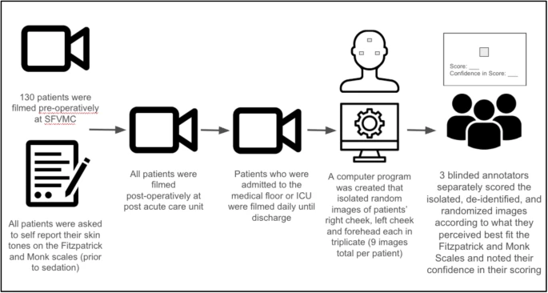
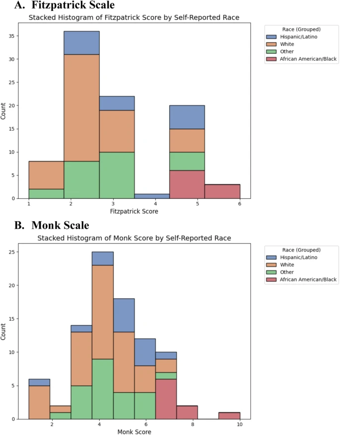
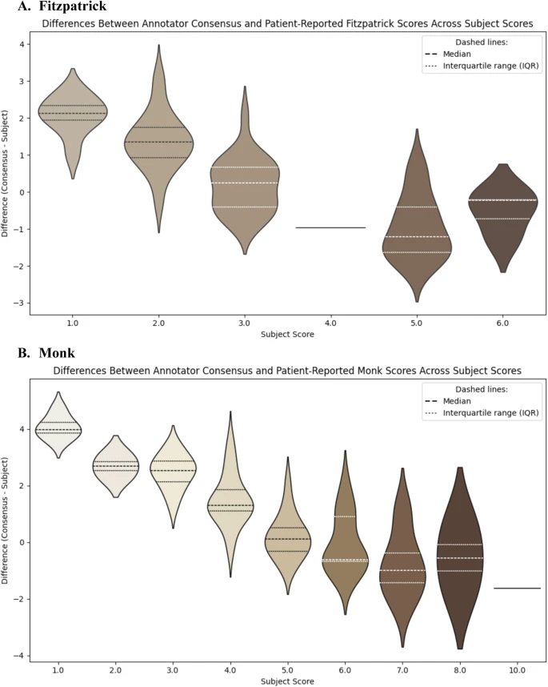

+++ 
draft = false
date = 2025-10-03T14:24:10-08:00
title = "Validity of two subjective skin tone scales and its implications on healthcare model fairness"
description = ""
slug = ""
authors = ["Hunter Mills"]
tags = []
categories = ["Publication Summary"]
externalLink = ""
series = []
+++
[Publication Link](https://www.nature.com/articles/s41746-025-01975-7)

## Introduction
Fairness assessments for medical AI—especially for devices like pulse‑oximeters or dermatology classifiers—often rely on **subjective skin‑tone scales** (the Fitzpatrick and Monk scales). Our recent prospective study, published in npj Digital Medicine (2025), shows that these scales are far from reliable. Below I walk through the motivation, methodology, key findings, and practical take‑aways for anyone building or auditing health‑care AI systems.

## Why the Question Matters

* **Clinical stakes:** Pulse‑oximeter readings that over‑estimate oxygen saturation in darker‑skinned patients have already been linked to delayed treatment and higher mortality.
* **Algorithmic bias:** Computer‑vision models trained on under‑represented skin tones misclassify lesions, widening diagnostic gaps.
* **Regulatory pressure:** The FDA now urges developers to evaluate devices across diverse pigmentations, often using the Fitzpatrick scale as a proxy.

But are these scales truly measuring what we think they are?

## Study Design at a Glance
|Aspect|Details|
|:---|:---|
|Population|90 hospitalized adults (median age 72 years, 77% male) from the San Francisco VA Medical Center.|
|Images|810 facial photographs (3 facial regions × 3 repeats per patient).|
|Scales Tested|Fitzpatrick (I–VI) and Monk (1–10).|
Annotators|Three independent raters of diverse ethnic backgrounds; each rated every image in triplicate.|
|Patient Input|Self‑reported skin tone on both scales.|
|Metrics|Cronbach’s α (internal reliability), ICC(2,k), weighted Cohen’s κ, Kendall’s W, Krippendorff’s α, paired t‑tests, Spearman ρ, mixed‑effects regression, Bland‑Altman plots.|

All statistical work was done in Python (v3.12) on a consolidated Pandas dataframe.

|Study Design|
|---|
|

## Key Results

1. **Internal Consistency is High:** Cronbach’s α ranged from 0.88–0.93 for both scales, indicating each annotator was internally reliable.
2. **Inter‑Annotator Agreement is Moderate‑to‑Low**
	* **ICC(2,k):** 0.66 (Fitzpatrick) and 0.64 (Monk).
	* **Weighted Cohen’s κ (pairwise):** 0.63/0.64 (Annotator 1 vs 2) but dropped to 0.29–0.39 for other pairs.
	* **Kendall’s W (overall ranking):** 0.90 (Fitzpatrick) vs 0.85 (Monk).
	* **Krippendorff’s α:** 0.41 for both scales.
3. **Systematic Bias Between Patients and Annotators**
	* **Paired t‑tests showed significant differences (p < 0.001):** annotators tended to assign lighter scores than patients reported.
	* Spearman correlations between the difference (annotator – patient) and the patient’s self‑score were strongly negative (−0.82 for Fitzpatrick, −0.84 for Monk).
4. **Mixed‑Effects Model Highlights Predictors**

|Variable|Fitzpatrick β (p)|Monk β (p)|
|:---|:---|:---|
|Self‑reported score|−0.727 (p<0.001)|−0.823 (p<0.001)|
|Annotator confidence = 4| 0.157 (p=0.043)|1.293 (p<0.001)|
|Annotator confidence = 5|0.581 (p<0.001)|1.726 (p<0.001)|
|Right cheek (vs. forehead)| 0.385 (p<0.001)|0.299 (p<0.001)|
|Left cheek (vs. forehead)|0.057 (not significant)|0.028 (not significant)|

Higher self‑reported skin tones predict lower annotator scores, even after accounting for facial region and confidence.

5. **Visualization:** Violin plots and Bland‑Altman charts illustrate that annotators cluster around the mid‑range, whereas patients gravitate toward the extremes of each scale.

|Patient Self Identified Skin Tone Scores|
|---|
|

|Comparing Annotator and Patient Scores|
|---|
|

## What This Means for Fairness Audits

1. **Subjective scales are noisy:** Even with trained raters, agreement is only moderate. Relying on a single annotator or a small pool can dramatically skew bias estimates.
2. **Self‑report vs. perception gap:** Patients systematically rate themselves darker (or lighter) than external observers. Audits that compare algorithm performance against “ground‑truth” skin‑tone labels may be comparing against a biased reference.
3. **Facial region matters:** Right cheek images yielded higher scores; lighting and pose variations can introduce systematic error.
4. **Confidence improves consistency:** Higher annotator confidence correlates with higher (darker) scores, suggesting that training annotators to recognize uncertainty could reduce bias.

## Recommendations for Practitioners

1. **Use Multiple, Diverse Annotators:** Aim for ≥ 5 raters with balanced demographic backgrounds; compute consensus scores with robust statistics (e.g., median rather than mean).
2. **Combine Subjective and Objective Measures:** Where feasible, supplement scales with spectrophotometric melanin indices or calibrated imaging devices.
3. **Standardize Image Capture:** Control lighting, camera settings, and facial pose; record metadata to adjust for systematic regional effects.
4. **Report Uncertainty:** Include confidence intervals for inter‑rater metrics and disclose the annotator‑patient disagreement magnitude.
5. **Document Annotation Protocols:** Publish detailed guidelines (e.g., visual analog references, calibration exercises) so that future studies can replicate or improve upon them.

## Limitations of Our Study

* **Sample size & demographics:** Only 90 patients, predominantly White and male; results may not generalize to broader populations.
* **No objective melanin reference:** We relied solely on subjective scales; future work should incorporate spectrophotometry.
* **Single‑institution setting:** All images came from a VA hospital; lighting and environmental factors may differ elsewhere.

## Closing Thoughts
Subjective skin‑tone scales, despite their ubiquity, are **insufficient** as the sole fairness metric for medical AI. Their moderate inter‑rater reliability and systematic bias relative to self‑reports can mask—or even create—apparent disparities. By embracing richer annotation pipelines, objective pigment measurements, and transparent reporting, we can move toward truly equitable health‑technology deployments.
