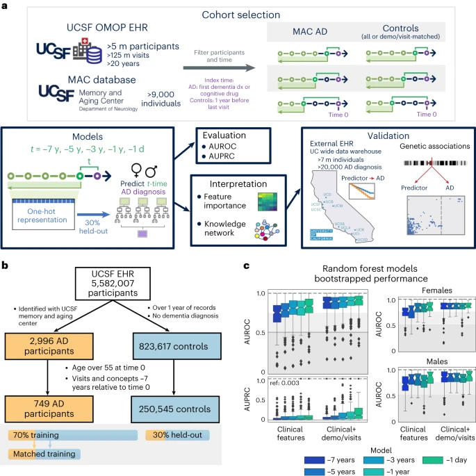
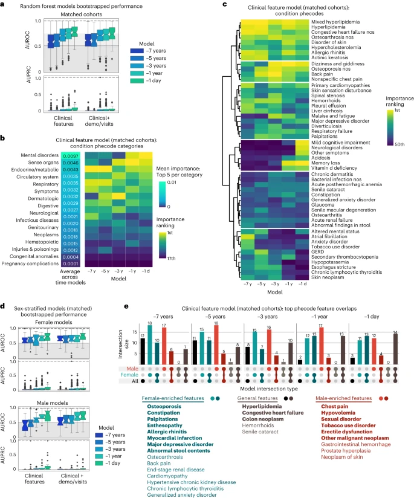

+++ 
draft = false
date = 2024-02-21T12:55:23-08:00
title = "Leveraging electronic health records and knowledge networks for Alzheimer's disease prediction and sex-specific biological insights"
description = "This post summarizes a Nature Aging study predicting Alzheimer's disease up to seven years before diagnosis using routine EHR data and a biomedical knowledge graph. Random forest models achieved AUROC 0.90 near diagnosis and 0.72 at seven years. Sex-stratified analyses revealed divergent risk profiles, with osteoporosis and major depression female-specific, and chest pain male-specific. Integrating the SPOKE knowledge graph linked predictors to genes like APOE and IL6, translating statistics into biologically plausible hypotheses."
slug = ""
authors = ["Hunter Mills"]
tags = []
categories = ["Publication Summary"]
externalLink = ""
series = []
+++
[Publication Link](https://www.nature.com/articles/s43587-024-00573-8)

## Introduction

Alzheimer’s disease (AD) remains the most common form of dementia after age 65, and early identification of individuals at risk is essential for timely interventions. In our recent Nature Aging paper (Vol 4, March 2024, pp 379‑395) we show how routine clinical data—specifically electronic health records (EHRs) from the University of California, San Francisco (UCSF)—can be turned into a powerful, interpretable prediction tool. By coupling traditional machine‑learning pipelines with a heterogeneous biomedical knowledge graph (SPOKE), we achieve three goals:

1. *Accurate prediction of AD onset up to seven years in advance.*
2. *Prioritization of biologically plausible hypotheses from the top predictors.*
3. *Explicit modeling of sex‑specific risk patterns.*

Below is a concise walk‑through of the study design, key results, and what the findings mean for clinicians, researchers, and anyone interested in data‑driven health care.

## Cohort Construction
|Group|Size|Selection Criteria|
|:---|:---|:---|
|AD cases (UCSF Memory & Aging Center)|749|Expert‑confirmed AD diagnosis, ≥ 7 years of longitudinal EHR data, age ≥ 55 at index time|
|Controls (UCSF OMOP EHR)|250,545|No dementia diagnosis, ≥ 1 year of visits, age ≥ 55, matched on basic demographics for a subset|

30% of the combined cohort was held out for evaluation; the remaining 70% was used for model training and hyper‑parameter tuning.
We also built *propensity‑score‑matched subsets* (1 AD : 8 controls) that balanced birth year, race/ethnicity, sex, and visit‑related variables (first‑visit age, years in EHR, number of visits, etc.). This matching isolates the predictive signal of clinical features from demographic confounders.

## Feature Extraction

* **Clinical concepts:** Diagnoses, drug exposures, abnormal lab measurements (one‑hot encoded).
* **Demographics & visit metrics:** Age at prediction, first‑visit age, years in the health system, log‑transformed counts of visits and concepts, log‑days since first event.

Overall, each time‑point model used 5k–24k features (the larger number reflects the inclusion of demographics/visit metrics).

## Modeling Approach

* **Algorithm:** Random Forest (RF) – chosen for strong performance on high‑dimensional, collinear data and for built‑in interpretability (feature importance via Gini impurity decrease).
* **Time points:** −7y, −5y, −3y, −1y, −1d relative to the AD index date.
* **Baseline comparisons:** Elastic‑net logistic regression, permutation tests, and balanced‑accuracy metrics.

All models were evaluated on *300 bootstrap* replicates of the held‑out set (1,000 patients per replicate) to obtain robust AUROC/AUPRC distributions.

|---|

## Core Results

|Model|AUROC (median)|AUPRC (median)|Comments|
|:---|:---|:---|:---|
|Clinical‑only RF (−7 y)|0.72|>0.003 (prevalence)|Early signal detectable 7y before diagnosis|
|Clinical‑only RF (−1d)|0.81|>0.10|Near‑term prediction|
|Clinical + Demo/Visit RF (−7y)|0.860|.06|Demographics modestly boost performance|
|Clinical + Demo/Visit RF (−1d)|0.90|0.27|Highest achievable discrimination|

Sex‑stratified models performed slightly better in females (AUROC up to 0.84) than males (AUROC up to 0.82), reflecting known epidemiologic differences.
#### Top predictive clinical features (consistent across time points)

* Hyperlipidemia (HLD)
* Hypertension
* Dizziness / abnormal stool content
* Cataracts
* Osteoporosis (female‑specific)
* Major depressive disorder (female‑specific)
* Chest pain / hypovolemia (male‑specific)

These features were identified *without any laboratory biomarkers*, underscoring the richness of routine EHR data.

## Biological Interpretation via SPOKE

We mapped the 25 highest‑importance clinical predictors to nodes in the SPOKE knowledge graph and extracted the shortest paths to the AD disease node. The network highlighted several recurrent genes and compounds:

* **Genes:** APOE, ACTB, IL6, INS, ALB, SOD1, AKT1, TNF, TREM2, MAPT, C9orf72.
* **Compounds:** Atorvastatin, Simvastatin, Ergocalciferol (vitamin D), Progesterone, Estrogen, Cyanocobalamin (B12), Folic acid.

These connections provide mechanistic hypotheses—for instance, the repeated appearance of *APOE* and *IL6* bridges hyperlipidemia, osteoporosis, and AD, aligning with prior literature on lipid metabolism and inflammation in neurodegeneration.

|---|

## External Validation
Using the University of California Data Discovery Platform (UCDDP) (five additional UC health systems), we performed a retrospective cohort analysis on two exposures:

1. **Hyperlipidemia (HLD):** Significantly accelerated AD onset (HR≈1.5, p<0.001).
2. **Osteoporosis:** Strong effect in females (HR≈1.8, p<0.001) but not in males.

Both findings survived adjustment for demographics and visit‑related covariates, reinforcing the internal model’s external generalizability.

## Limitations & Future Directions

* **EHR sparsity:** Absence of a code does not guarantee absence of a condition.
* **Label noise:** AD diagnosis in routine care may mix clinical subtypes.
* **Temporal granularity:** Binary "presence/absence" of a code ignores severity or trajectory.

Future work will explore continuous lab trajectories, medication adherence patterns, and multimodal data (imaging, genomics) to refine risk estimates. Incorporating causal inference (e.g., Mendelian randomization) could further separate true biological drivers from health‑system artifacts.

## Take‑Home Messages

1. Routine EHRs alone can predict AD onset with clinically useful accuracy up to seven years before diagnosis.
2. Random Forests provide interpretable feature importance, revealing both known (hyperlipidemia, hypertension) and less‑studied (osteoporosis, abnormal stool) risk factors.
3. Integrating a biomedical knowledge graph translates statistical predictors into biologically plausible hypotheses, pointing to shared genes (APOE, IL6) and druggable pathways (statins, vitamin D).
4. Sex‑specific modeling uncovers divergent risk profiles, emphasizing the need for tailored screening strategies.

Our pipeline demonstrates a pragmatic route from *real‑world clinical data to predictive model to mechanistic insight*, paving the way for early‑intervention programs that are both data‑driven and biologically grounded.
