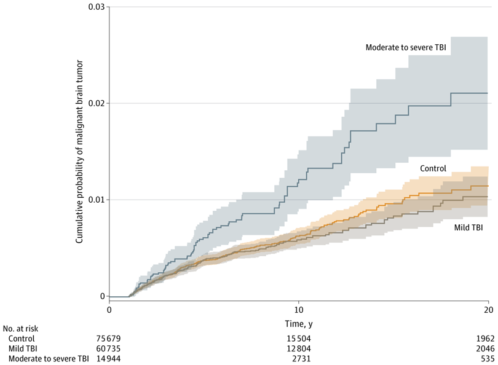
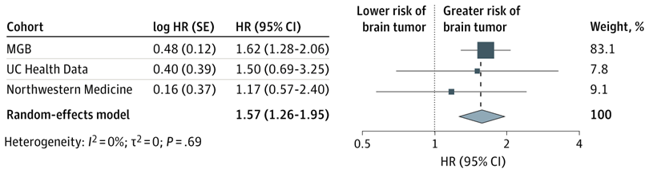

+++ 
draft = false
date = 2025-08-25T16:18:38-08:00
title = "Traumatic Brain Injury and Risk of Malignant Brain Tumors in Civilian Populations"
description = ""
slug = ""
authors = ["Hunter Mills"]
tags = []
categories = ["Publication Summary"]
externalLink = ""
series = []
+++
[Publication Link](https://jamanetwork.com/journals/jamanetworkopen/fullarticle/2837955)

## Why This Study Matters

Traumatic brain injury (TBI) is a leading cause of disability worldwide, yet its long‑term oncologic sequelae remain poorly understood. A 2024 veteran‑population study suggested a link between severe TBI and brain cancer, but civilian data have been contradictory. Our multicenter retrospective cohort—spanning three major U.S. academic health systems—provides the most extensive civilian evidence to date, showing that moderate‑to‑severe TBI is associated with a roughly 50% higher risk of developing a malignant brain tumor.

## Study Design at a Glance
|Component|Details|
|:---|:---|
|Cohorts|Mass General Brigham (MGB): 151,358 adults; University of California Health Data Warehouse (UC Health): 39,403 TBI‑control pairs; Northwestern Medicine: 16,222 TBI‑control pairs|
|Period|Jan 1 2000 – Jan 1 2024|
|Exposure|ICD‑9/10‑coded TBI, stratified into mild and moderate‑to‑severe (the latter includes moderate, severe, and penetrating injuries)|
|Outcome|First diagnosis of any malignant brain tumor (ICD‑9/10) after a 1‑year lag|
|Matching|1:1 propensity‑score match on age, sex, race/ethnicity, and encounter frequency|
Statistical Methods|Cox proportional‑hazards models (adjusted for age, sex, race/ethnicity); meta‑analysis across sites using a DerSimonian‑Laird random‑effects model|

|Kaplan Meier Curve|
|:---:|
||

## Key Findings

* **Meta‑analysis Across All Three Sites**
	* Combined HR for moderate‑to‑severe TBI: **1.57 (95% CI 1.26‑1.95)**, indicating a ~57% increase in risk.
	* No significant association for mild TBI (HR ≈ 1.00).
* **Consistency**
	* Individual site analyses showed directionally similar effect sizes (MGB HR = 1.62; UC Health HR = 1.50; Northwestern HR = 1.17).
	* Heterogeneity was negligible (I² = 0%).
* **Sensitivity Analyses**
	* Matching specifically on the moderate‑to‑severe subgroup confirmed the association (HR = 1.47, 95% CI 1.06‑2.04).

|Meta Analysis|
|:---:|
||

## Interpretation

* **Severity matters.** Only moderate‑to‑severe injuries—not mild concussions—showed a statistically robust increase in tumor risk.
* **Biological plausibility.** TBI triggers chronic neuroinflammation, oxidative stress, and astrocyte proliferation—all pathways implicated in gliomagenesis.
* **Public‑health implication.** While absolute risk remains low (<1%), the relative increase suggests that clinicians might consider longer‑term neuro‑oncologic surveillance for patients with severe TBI, especially when other risk factors (e.g., ionizing radiation exposure) coexist.

## Limitations

* **Tumor histology unavailable.** We could not differentiate gliomas from other malignant CNS neoplasms.
* **Radiation exposure not captured.** Imaging‑related radiation could confound the association.
* **Unmeasured confounders.** Socio‑economic status, lifestyle factors (smoking, alcohol), and repeat TBIs were not accounted for.
* **Observational design.** Causality cannot be definitively established.

## What’s Next?

1. **Mechanistic studies** exploring how chronic inflammation after TBI drives oncogenic transformation.
2. **Prospective registries** that capture detailed radiation histories, repeat injuries, and molecular tumor subtyping.
3. **Risk‑prediction modeling** integrating TBI severity, genetics, and environmental exposures to guide personalized surveillance strategies.
