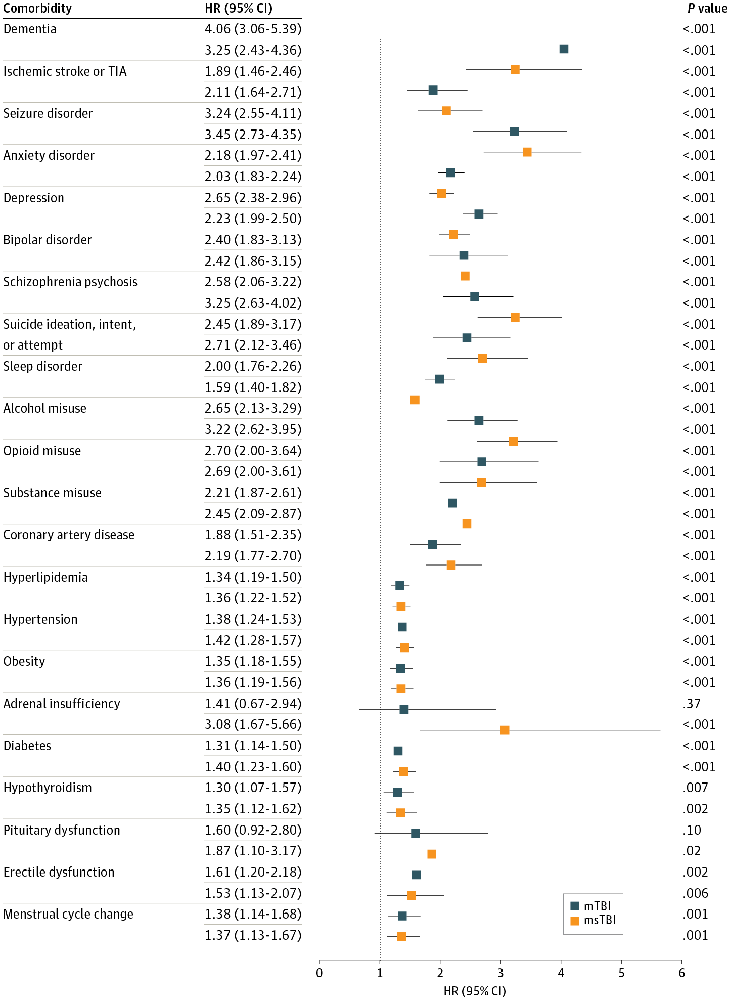
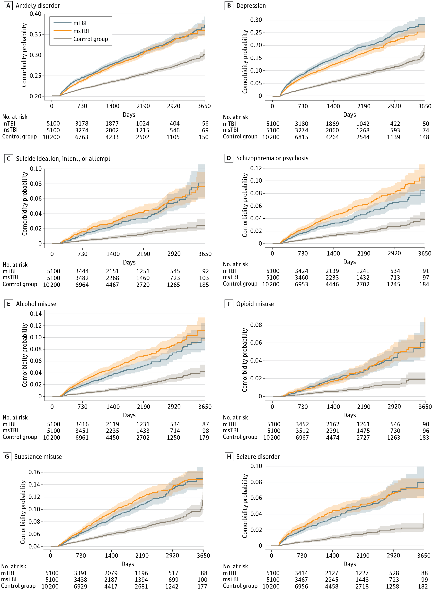

+++ 
draft = false
date = 2024-12-12T20:08:52-08:00
title = "Traumatic Brain Injury and Risk of Incident Comorbidities"
description = "This post summarizes a JAMA Network Open analysis linking TBI to elevated long-term risks across neurological, psychiatric, cardiovascular, and endocrine domains. In a cohort of 20,400 patients, hazard ratios exceeded 2.0 for depression, suicidality, seizure disorder, and dementia, with effects persisting up to a decade. Middle-aged patients showed the highest suicidality risk, while neighborhood disadvantage amplified certain psychiatric outcomes. The authors argue TBI should be treated as a chronic condition requiring longitudinal, multidisciplinary follow-up."
slug = ""
authors = ["Hunter Mills"]
tags = []
categories = ["Publication Summary"]
externalLink = ""
series = []
+++
[Publication Link](https://jamanetwork.com/journals/jamanetworkopen/fullarticle/2827801)

## Why this study matters
Traumatic brain injury is often treated as an acute event, yet mounting evidence shows that the consequences can stretch far beyond the initial hospitalization. Our recent cohort analysis—published in JAMA Network Open (Dec 2024)—adds a large, geographically distinct dataset to the conversation. By linking five University of California health‑system records (2013‑2022) with a previously examined Massachusetts cohort, we provide a clearer picture of how a single TBI episode reshapes a patient’s health trajectory for up to a decade.

## Study design in a nutshell
|Element|Details|
|:---|:---|
|Population|20,400 adults (≥18 years) with a first‑recorded TBI (5,100 mild, 5,100 moderate‑to‑severe) and 10,200 matched controls without TBI.|
|Matching variables|Age, race/ethnicity, sex, UC site, insurance type, Area Deprivation Index (ADI) quintile, and time from index date to last encounter.|
|Follow‑up|Median 3.4–3.6 years (range up to 10 years) after the 6‑month “wash‑out” period.
|Outcomes|22 incident comorbidities spanning neurological, psychiatric, cardiovascular, and endocrine domains, identified via ICD‑9/10 codes.AnalysisCox proportional‑hazard models (adjusted for demographics, ADI, insurance, site). Stratified analyses by age group (young 18‑40, middle 41‑60, older 61‑90) and ADI quintile (low 1‑2 vs. high 9‑10).|

## Key findings

1. Across‑the‑board risk elevation – Any TBI raised the hazard ratio (HR) for nearly every condition examined.
2. Neurological outcomes
	* Seizure disorder: HR ≈ 3.3 (both severity levels).
	* Dementia: HR ≈ 4.0 (mild) and 3.3 (moderate‑severe).
3. Psychiatric outcomes
	* Depression: HR ≈ 2.6 (mild) and 2.2 (moderate‑severe).
	* Suicidality (ideation/attempt): HR ≈ 2.5 (mild) and 2.7 (moderate‑severe); spikes to HR ≈ 4.8 in middle‑aged adults.
	* Substance misuse (alcohol, opioids) and anxiety showed ≥ 2‑fold increases.
4. Cardiovascular outcomes
	* Hypertension: HR ≈ 1.4.
	* Hyperlipidemia: HR ≈ 1.35.
	* Coronary artery disease: HR ≈ 2.2 (moderate‑severe).
5. Endocrine outcomes
	* Hypothyroidism: HR ≈ 1.3–1.35.
	* Diabetes: HR ≈ 1.3–1.4.
	* Pituitary dysfunction and adrenal insufficiency rose markedly in the moderate‑severe group (HR ≈ 1.6–3.1).
6. Age‑specific patterns
	* Middle‑aged (41‑60 years) patients bore the greatest relative surge in suicidality (≈ 4‑fold).
	* Younger adults showed heightened seizure and dementia hazards; older adults retained elevated cardiovascular risk.
7. Neighborhood disadvantage (ADI)
	* Both low and high ADI quintiles exhibited amplified neuropsychiatric risk, but the direction of some comorbidities diverged.
	* High ADI amplified bipolar disorder, opioid misuse, and suicidality; low ADI correlated with higher cardiovascular incident rates.

|Hazard Ratios|
|:---:|
||

## What the numbers tell us
* **TBI ≠ isolated brain injury:** The hazard ratios consistently exceed 1.3, often surpassing 3, indicating that a single TBI can act as a catalyst for systemic disease pathways.
* **Severity matters, but even mild injuries are consequential:** While moderate‑to‑severe TBI generally produced larger HRs, many mild‑TBI estimates were comparable (e.g., seizure disorder HR 3.24 vs 3.45).
* **Social context shapes outcomes:** ADI stratifications highlight that socioeconomic environment interacts with biological vulnerability, reinforcing the need for equity‑focused post‑injury care.

|Kaplan Meier Curves|
|:---:|
||

## Clinical implications

1. **Routine longitudinal surveillance:** Screening protocols should extend beyond the first year, incorporating mental‑health assessments, metabolic panels, and neurologic checks up to a decade post‑injury.
2. **Targeted mental‑health resources:** The pronounced suicidality signal, especially in middle‑aged adults, warrants proactive counseling and crisis‑intervention pathways.
3. **Integrated care models:** Coordination between neurology, psychiatry, cardiology, and endocrinology can catch emerging comorbidities early, reducing morbidity.
4. **Addressing social determinants:** Tailoring follow‑up intensity based on ADI may help mitigate disparities; community outreach in high‑ADI neighborhoods could be pivotal.

## Limitations to keep in mind

* Reliance on administrative ICD coding (subject to misclassification).
* Lack of Glasgow Coma Scale data; severity inferred from Abbreviated Injury Scale.
* No non‑TBI trauma comparator, so some observed risks might reflect injury‑related healthcare utilization rather than brain‑specific mechanisms.
* Sex‑specific analyses were not performed despite a near‑equal gender distribution.

## Bottom line
Our California cohort validates and expands upon prior Massachusetts findings: TBI is a chronic health risk factor that reverberates across neurological, psychiatric, cardiovascular, and endocrine systems. Recognizing TBI as a lifelong condition—not just an acute event—should reshape clinical pathways, research agendas, and health‑policy planning.
