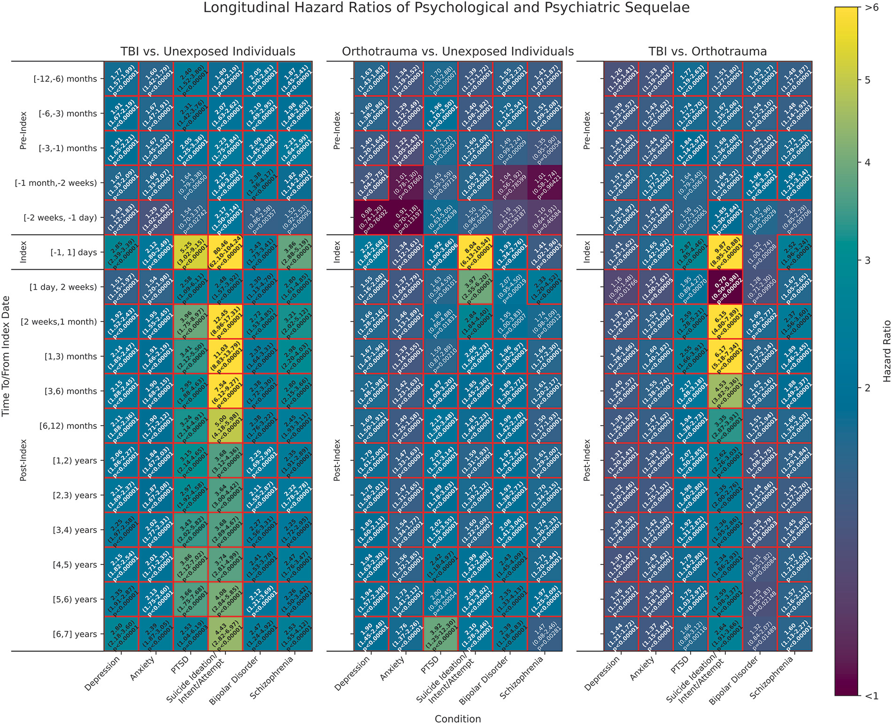
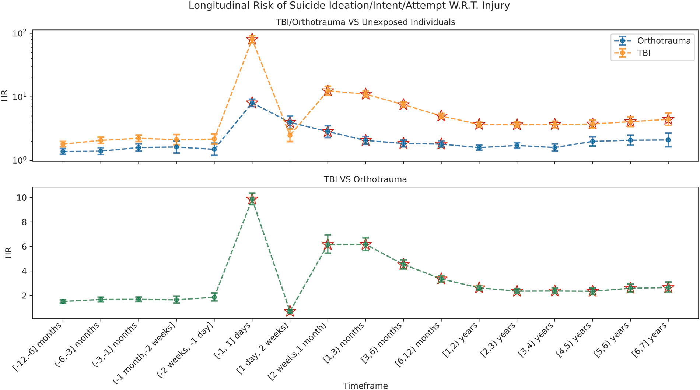

+++ 
draft = false
date = 2026-02-13T20:01:25-08:00
title = "Civilian Traumatic Brain Injury Is Associated with Longitudinally Increased Risk of PTSD, Suicidality, and Other Mental Health Diagnoses"
description = ""
slug = ""
authors = ["Hunter Mills"]
tags = []
categories = ["Publication Summary"]
externalLink = ""
series = []
+++
[Publication Link](https://pubmed.ncbi.nlm.nih.gov/41689233/)

## Why This Study Matters

Traumatic brain injury is already recognized as a leading cause of disability worldwide. Yet, most large‑scale epidemiologic work has either (a) excluded patients with pre‑existing psychiatric diagnoses or (b) lacked a **non‑head trauma comparator**. Without such a comparator, it’s hard to disentangle whether observed mental‑health sequelae stem from the **injury itself** or from the **broader trauma experience** (hospitalization, pain, loss of function, etc.).

We fill that gap by:

1. **Including patients with prior mental‑health conditions:** reflecting real‑world clinical populations.
2. **Propensity‑matching TBI patients to orthotrauma patients** on age, sex, race/ethnicity, insurance, socioeconomic deprivation, and health‑care utilization.
3. **Tracking both pre‑index (‑1 year) and post‑index (up to +7 years)** outcomes, allowing a view of baseline risk and the incremental effect of the injury.

## Study Design at a Glance

|Component|Details|
|:---|:---|
|Data source|UC Health Data Discovery Portal (UCDDP) – de‑identified EHRs from six UC medical centers (≈8.7 million patients).|
|Study period|2013 – 2022 (injury dates); analyses performed Aug 2024 – Jan 2025.|
|Cohorts|TBI (n=43,596), Orthotrauma (non‑head fractures, n=43,596), and Unexposed controls (no TBI/orthotrauma, n=87,192)|
|Matching|1:1 propensity match on demographics, insurance, Area Deprivation Index, prior visit count; then matched to unexposed (1:2).|
|Outcomes|ICD‑10‑CM coded diagnoses of depression, anxiety, PTSD, suicidality (ideation/intent/attempt), bipolar disorder, schizophrenia.|
|Analysis|Cox proportional‑hazards models (adjusted for documented suicide attempts). Bonferroni‑corrected significance threshold p<0.0000625.|

## Key Findings

|Overall Hazard Ratios Over Time|
|---|
||

#### PTSD

* **TBI vs. Orthotrauma:** Post‑injury HR≈1.75–2.59 (through Year 6).
* **Pre‑injury baseline:** HR≈1.74–1.84, indicating already elevated risk before the event.
* **Age‑specific peaks:** Adults (25‑43 years) and aged (65‑79 years) showed the strongest de‑novo post‑injury risk.

#### Suicidality

* **TBI vs. Orthotrauma:** Post‑injury HR≈2.34–6.17 (up to Year 7).
* **Highest risk window:** 6–12 months after injury (HR≈6).
* **Pre‑injury risk:** Already raised (HR≈1.80–2.32).
* **Across ages:** Young adults (18‑24 years) exhibited the steepest rise (HR≈2.6–7.6).

|Suicidality Focus|
|---|
||

#### Other Mental‑Health Diagnoses

|Outcome|General trend (TBI vs. Orthotrauma)|
|:---|:---|
|Depression|Slightly higher HRs for TBI, but post‑injury HRs similar to pre‑injury (1.30–1.46).|
|Anxiety|Similar pattern to depression; modest TBI‑specific increase in young adults and elderly during early epochs.|
|Bipolar disorder|Elevated pre‑ and post‑injury HRs for TBI (≈2) but no clear divergence from orthotrauma.|
|Schizophrenia|Higher pre‑injury HRs for TBI; post‑injury HRs rise briefly around the index date then converge.|

Overall, **PTSD and suicidality** stand out as the **most robust, TBI‑specific mental‑health sequelae.**

## Interpretation & Clinical Implications

1. **Brain‑specific pathology matters.** The differential hazard between TBI and orthotrauma suggests that neurobiological injury (e.g., disruption of fronto‑limbic circuits) contributes uniquely to PTSD and suicidal behavior, beyond the shared stress of any serious trauma.
2. **Early post‑injury window is critical.** The 6‑12‑month surge in suicidality aligns with the period when patients transition from acute care to community living, often encountering gaps in follow‑up. Targeted screening and intervention during this window could avert many adverse outcomes.
3. **Screening should be universal.** Since the study deliberately included patients with prior psychiatric histories, the findings reinforce that all TBI survivors—not just “clean” cases—need systematic mental‑health assessment.
4. **Risk stratification by age and sex.** While both males and females showed heightened risk, certain age brackets (young adults for suicidality; middle‑aged/aged adults for PTSD) may benefit from tailored monitoring protocols.
5. **Policy & health‑system level actions.** Integrating automated alerts within EHRs (e.g., flagging a TBI diagnosis to trigger a mental‑health consult) could operationalize the authors’ recommendation for “uniform screening”.

## Limitations Worth Noting

* **Severity granularity missing.** ICD‑10 codes cannot differentiate mild vs. severe TBI, nor capture mechanisms (e.g., blast vs. fall).
* **Inpatient vs. outpatient not distinguished.** The dataset does not separate care settings, which could affect outcome ascertainment.
* **Potential residual confounding.** Although extensive matching was performed, unmeasured variables (e.g., substance use, social support) may still influence hazard estimates.
* **Generalizability.** The cohort reflects California’s diverse but specific health‑system environment; replication in other regions would strengthen external validity.

## Bottom Line for Practitioners & Researchers

* TBI is a potent, independent predictor of long‑term PTSD and suicidality.
* The first year—especially months 6–12—is a high‑yield period for intervention.
* Embedding routine, automated mental‑health screening into trauma pathways could dramatically reduce morbidity.

Future work should aim to (a) parse out the contribution of injury severity, (b) explore neuroimaging or biomarker correlates of the mental‑health risk, and (c) test targeted preventive programs in randomized trials.
