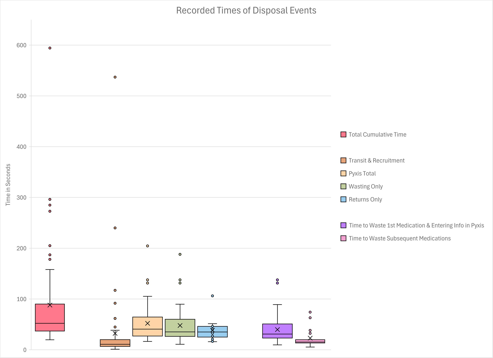

+++ 
draft = false
date = 2026-03-17T17:33:25-07:00
title = "Time and Motion Analysis of Controlled Substance Disposals: A Study of Workflows at a Single Center using Automated Dispensing Cabinets"
description = "A time-and-motion study of 55 controlled substance disposals at a VA medical center revealed that the honor-system workflow is broken: 80% of disposals lacked independent verification, 38% did not show the syringe or volume to the witness, and wait times for witnesses ranged up to nine minutes. Despite this, 71% of clinicians believed diversion remained possible. The post argues for computer-vision-based automated verification and real-time anomaly detection to replace manual witnessing with intelligent accountability."
slug = ""
authors = ["Hunter Mills"]
tags = []
categories = ["Publication Summary"]
externalLink = ""
series = []
+++

[Publication Link](https://journals.lww.com/anesthesiologyopen/fulltext/2026/01000/time_and_motion_analysis_of_controlled_substance.8.aspx)

ntrolled substance diversion in healthcare is a silent epidemic. Estimates suggest that between 1% and 8% of these substances are diverted from lawful to unlawful use, yet the true number is likely higher due to chronic underreporting. The consequences are severe: patient infections, compromised care, and massive institutional penalties.

For years, the industry has relied on a fragile "honor system" for disposing of unused medications. Anesthesiologists and nurses must manually witness the waste, enter data into automated dispensing cabinets (ADCs), and trust that the process is followed correctly. But a recent study we conducted at the San Francisco Veterans Affairs Medical Center reveals a stark reality: this system is broken, inefficient, and riddled with vulnerabilities.

### The Reality of the Workflow

In our time-and-motion analysis published in *Anesthesiology Open*, we observed 55 controlled substance disposal events over six weeks. The findings were illuminating and concerning:

*   **The "Honor System" Failure:** In 80% of observed events, the person disposing of the drug (the custodian) also entered the data into the ADC. True independent verification was the exception, not the rule.
*   **Missing Verification:** In 38.2% of disposals, neither the syringe label nor the volume was physically shown to the witness. In another 10.9%, only the label was shown.
*   **Workflow Friction:** While the actual time spent at the cabinet was relatively short (mean of 52 seconds), the process of recruiting a witness caused significant delays, with wait times ranging from 1 second to nearly 9 minutes.
*   **Clinician Skepticism:** Despite the rigid protocols, 71.5% of surveyed clinicians believed diversion could still occur within existing systems. Many felt the current processes were inadequate to prevent discrepancies.

The data suggests a disconnect between policy and practice. Clinicians perceive the system as unreliable, yet the workflow forces them to rely on trust rather than verifiable data.

||
|---|

### Bridging the Gap with Machine Learning

As a Machine Learning Engineer currently working at a stealth startup focused on controlled substance monitoring and tracking in operating rooms, I see a clear path forward. The problem isn't a lack of regulation; it's a lack of robust, automated verification.

Traditional ADCs are passive record-keepers. They log what a user *says* happened, not what *actually* happened. The future of diversion prevention lies in active, computer-vision-based monitoring. Imagine a system where:

1.  **Independent Verification is Automated:** Cameras and optical sensors verify that the correct drug, label, and volume are present and destroyed, removing the reliance on human witnesses who are often distracted by patient care.
2.  **Real-Time Anomaly Detection:** ML models can analyze disposal patterns in real-time, flagging irregularities (e.g., frequent waste of specific high-risk drugs by a single provider) before they become systemic issues.
3.  **Seamless Integration:** Technology should reduce workflow friction, not add to it. Automated logging eliminates the need for manual data entry, freeing up clinicians to focus on patient care.

Our research indicates that 67.9% of respondents would be comfortable with cameras facilitating disposal. The appetite for change is there; the technology is ready.

### The Path Ahead

The tension between efficiency and accountability in controlled substance disposal is solvable, but only if we move beyond administrative tracking and embrace technological solutions. As we continue to refine our research and develop new tools, the goal remains clear: to create a system where diversion is not just discouraged, but technically impossible to hide.

The stakes are too high for the status quo. It’s time to replace the honor system with intelligent, verifiable accountability.
