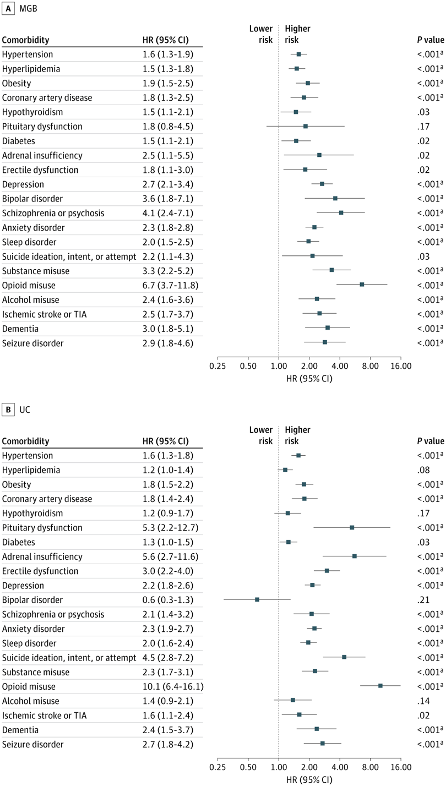
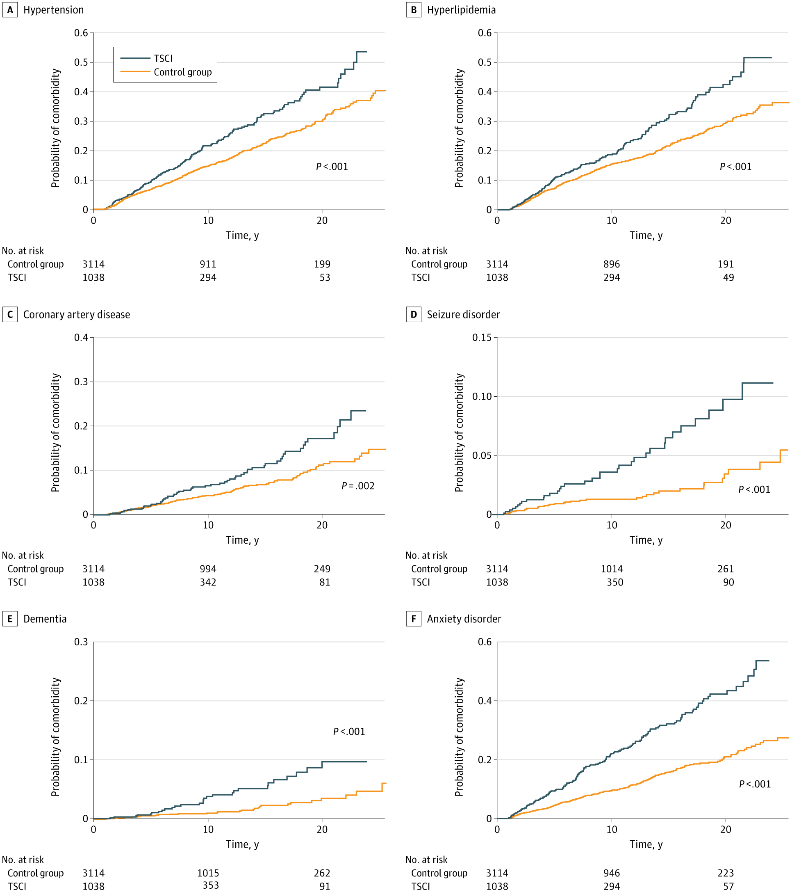

+++ 
draft = false
date = 2025-11-04T16:51:48-08:00
title = "Traumatic Spinal Cord Injury and Subsequent Risk of Developing Chronic Cardiovascular, Neurologic, Psychiatric, and Endocrine Disorders"
description = ""
slug = ""
authors = ["Hunter Mills"]
tags = []
categories = ["Publication Summary"]
externalLink = ""
series = []
+++
[Publication Link](https://jamanetwork.com/journals/jamanetworkopen/fullarticle/2840897)

## Beyond the Acute Phase: Why Traumatic Spinal Cord Injury Is a Lifelong Health Challenge

When most clinicians think of traumatic spinal cord injury (TSCI), the image that comes to mind is often that of a dramatic, life‑changing accident followed by intensive rehabilitation. The focus, understandably, is on restoring mobility, preventing pressure sores, and managing bladder or bowel function. Yet a growing body of evidence tells us that the story doesn’t end when the patient leaves the rehab unit.
Our recent paper in JAMA Network Open—a joint effort between the Mass General Brigham (MGB) network and the University of California (UC) health system—provides the most comprehensive look yet at the long‑term health trajectory of people living with TSCI. By linking two massive electronic‑health‑record databases spanning nearly three decades (1996‑2024), we examined more than 2,700 TSCI patients and over 8,200 matched, uninjured controls. The goal? To answer a simple but crucial question: **Does surviving a spinal cord injury predispose someone to chronic diseases later in life?**

## The Numbers Speak
Across both cohorts, TSCI patients faced a consistent, statistically significant elevation in risk for a wide array of conditions:

|Hazard Ratios|
|:---:|
||

Perhaps most sobering is the **mortality gap:** 14% of TSCI patients died during follow‑up versus 10% of controls. When we dug deeper, comorbidities such as hypertension, pituitary dysfunction, adrenal insufficiency, depression, substance misuse, seizures, and dementia each carried a two‑ to six‑fold increase in odds of death.

## Timing Matters

The injury probabilites remained higher even 20 years post TSCI, underscoring that many of these complications emerge well after the acute phase. Importantly, the latency was shorter in the TSCI group than in controls, suggesting that the injury itself accelerates disease onset rather than merely exposing patients to more health‑care encounters.

|Kaplan Meier Curves|
|:---:|
||

## Why Do These Risks Exist?

Our discussion section outlines several plausible mechanisms:
1. **Autonomic dysregulation:** Injuries, especially at thoracic levels, disrupt sympathetic outflow, impairing blood pressure regulation and vascular health.
2. **Neuroinflammation:** Persistent inflammatory signaling in the central nervous system may spill over into systemic circulation, fostering atherosclerosis and neurodegeneration.
3. **Behavioral shifts:** Reduced physical activity, altered diet, and social isolation are common after TSCI and are well‑known risk factors for cardiometabolic disease and mood disorders.
4. **Metabolic perturbations:** Emerging data point to gut‑microbiome changes and altered hormone axes (e.g., thyroid, gonadal) that could drive endocrine abnormalities.

## Clinical Takeaways

1. **Screen Early, Screen Often:** Traditional guidelines focus on acute complications; we need protocols that incorporate regular blood pressure checks, lipid panels, glucose monitoring, mental‑health assessments, and endocrine labs starting within the first few years post‑injury.
2. **Tailor by Injury Level:** Cervical injuries showed higher hypertension risk, whereas thoraco‑lumbar lesions were more strongly linked to dementia and seizures. Personalized surveillance could improve efficiency.
3. **Integrate Multidisciplinary Care:** Cardiologists, endocrinologists, psychiatrists, and neurologists should be part of the long‑term care team, not just physiatrists and surgeons.
4. **Educate Patients and Families:** Awareness of these hidden risks empowers patients to seek preventive care and adopt healthier lifestyles (e.g., structured exercise programs adapted for mobility limitations).

## Limitations & Future Directions

Our study relied on ICD‑9/10 coding, which, while generally reliable, can miss nuances such as disease severity. We also lacked granular data on injury severity scores, rehabilitation intensity, and socioeconomic factors—all of which could modulate risk. Future work should explore causal pathways (e.g., mediation analysis) and test interventions—perhaps leveraging wearable technology or digital health platforms—to mitigate these downstream effects.

## Closing Thoughts

The take‑home message is clear: Surviving a spinal cord injury does not mean the battle is over. It marks the beginning of a chronic health journey that spans cardiovascular, neurologic, psychiatric, and endocrine domains. By recognizing TSCI as a systemic condition, clinicians, researchers, and policymakers can shift from reactive to proactive care—ultimately improving longevity and quality of life for this vulnerable population.

