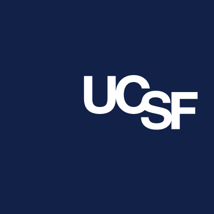
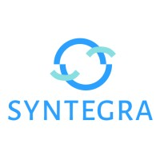
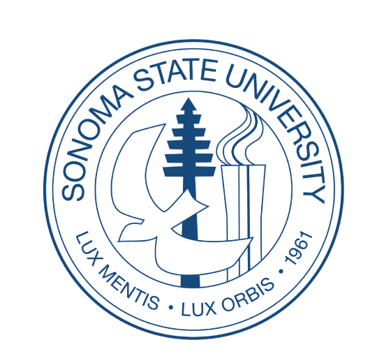
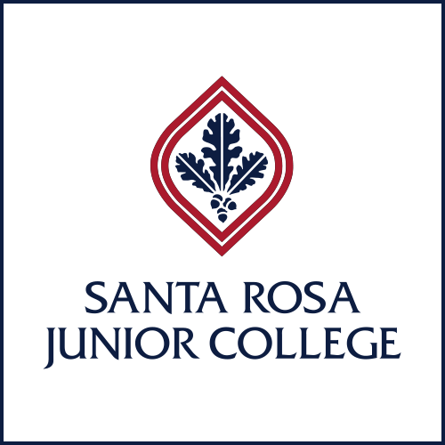

## Experience

|   | Company | Role | Dates | Location |
|---|---------|------|-------|----------|
|  | Stealth Mode Startup | Senior Machine Learning Engineer | 2025 – Present | San Francisco, CA |
|  | UCSF | Senior Machine Learning Engineer | 2022 – 2025 | San Francisco, CA |
|  | Syntegra | Machine   Learning Engineer | 2021 – 2022 | San Francisco, CA |
|  | LifeBell AI | Lead Data   Scientist | 2020 – 2021 | Remote Atlanta, GA |
|  | UCSF | Data Scientist | 2018 – 2020 | San Francisco, CA |
|  | NASA Education   and Public Outreach | Embedded Systems Engineer | 2014 – 2018 | Rohnert Park, CA |

## Education

|   | School | Degree | Date |
|---|--------|--------|------|
|  | Stanford University | MS Computational and Mathematical Engineering | 2018 |
|  | Sonoma State University | BS Physics and Astronomy, and BA Mathematics | 2014 |
|  | Santa Rosa Junior College | AS Mathematics | 2011 |